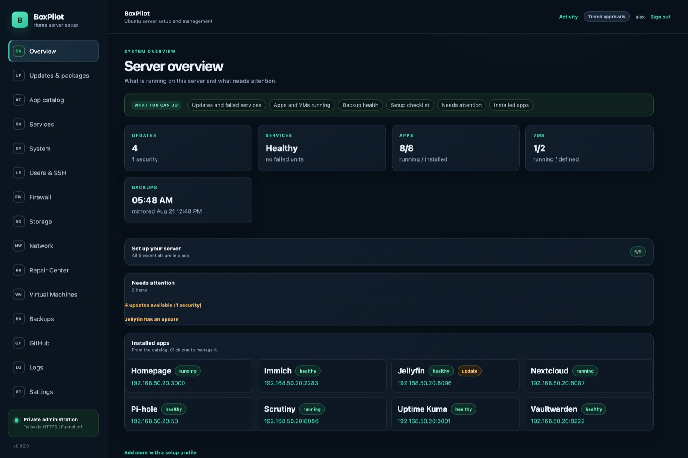
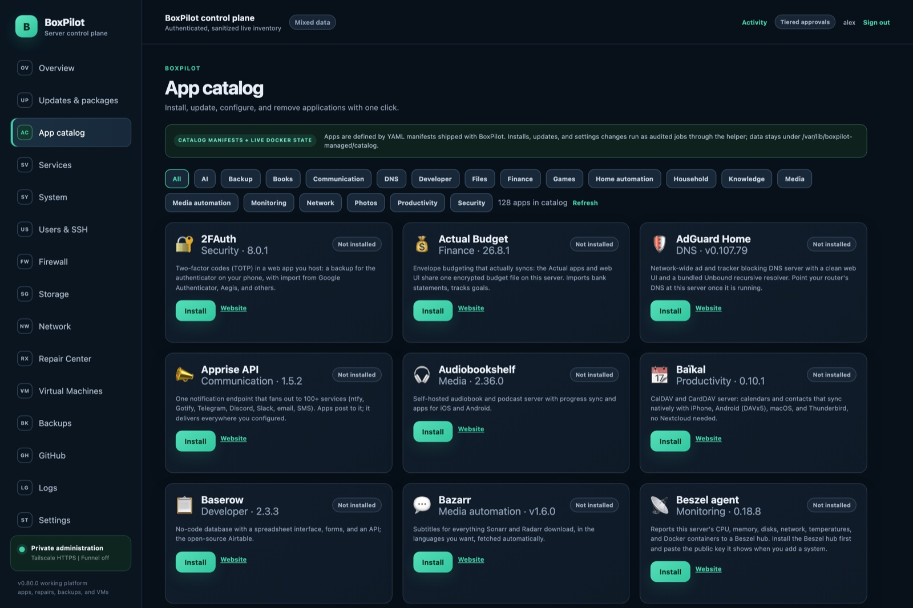
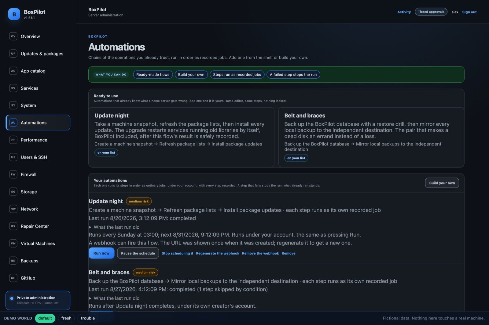
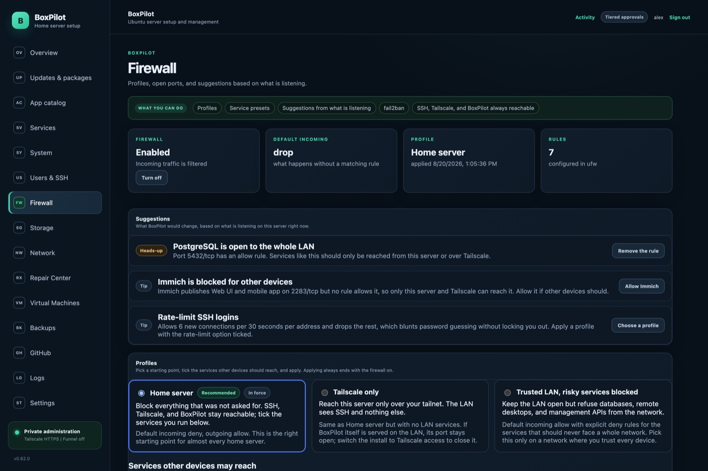
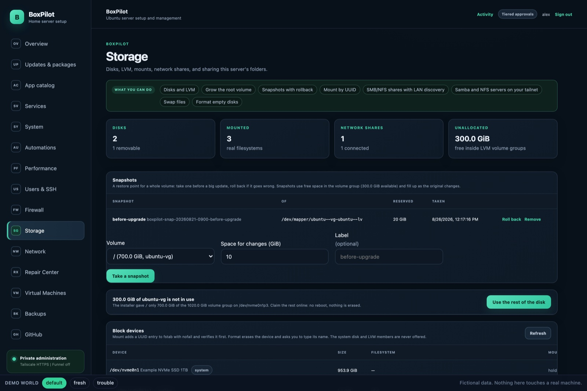
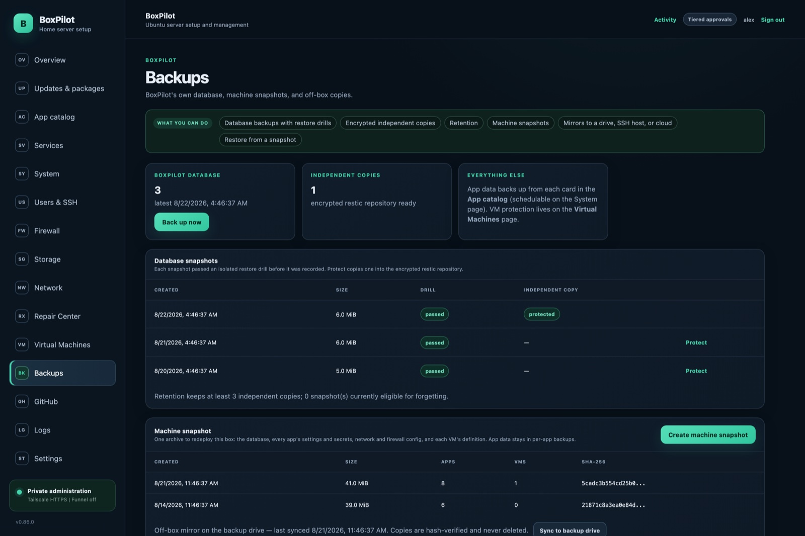
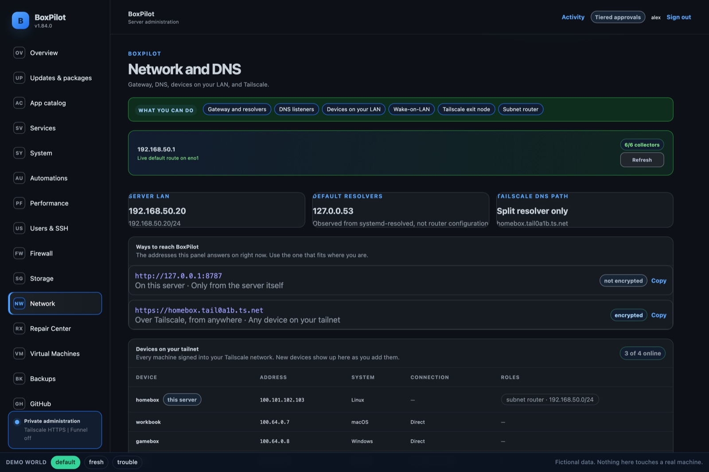
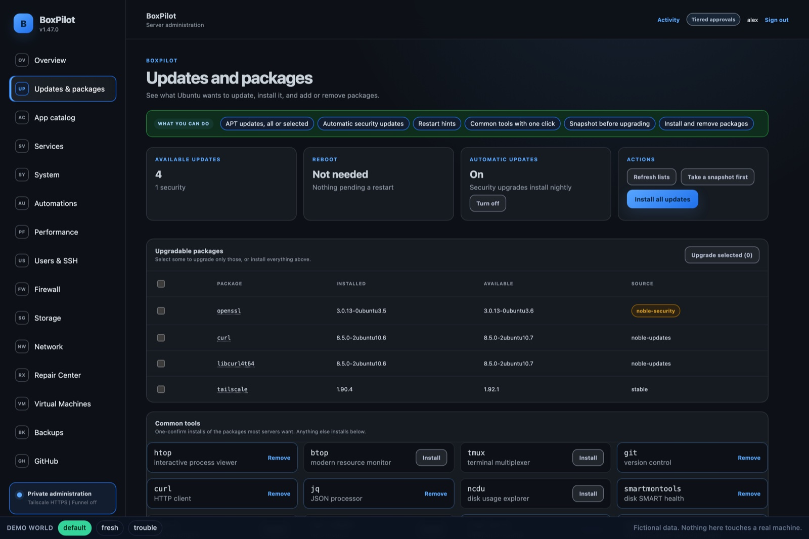
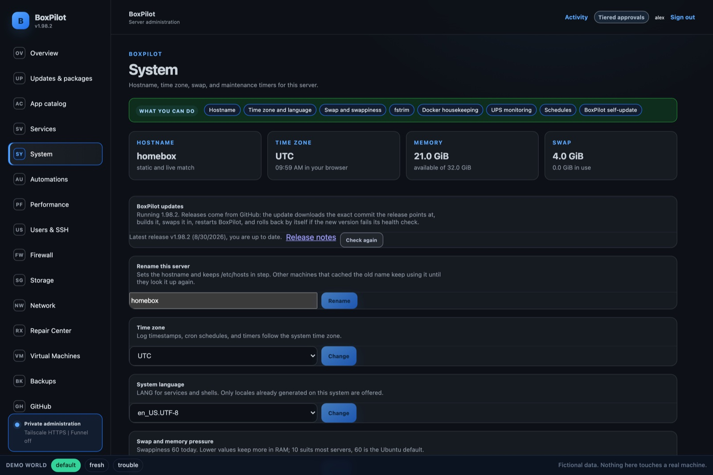

# BoxPilot

Point-and-click setup and management for an Ubuntu home server, from a browser, over your LAN or Tailscale.



Install updates, add apps from a catalog, open only the ports you mean to, mount and share storage, run VMs, and back everything up with restores that are actually tested. Low-risk changes are one click, medium-risk ones show a preview to confirm, high-risk ones ask for your password. A root helper does the work; the web process never runs privileged.

*Screenshots come from the built-in demo (`npm run demo`): the real UI on fictional data.*

## Install

On a fresh Ubuntu Server (22.04 or newer):

```bash
curl -fsSL https://raw.githubusercontent.com/AES256Afro/BoxPilot/main/scripts/boxpilot-install.sh | sudo sh -s -- --ref v1.92.0
```

It installs Node 24, builds BoxPilot under `/opt/boxpilot`, enables the `boxpilot` and `boxpilot-helper` services, and prints the URL with a one-time owner token. Create the owner account, pick a setup profile (home server, DNS appliance, hypervisor, dev box, media server, smart home, observability, or just the essentials), and follow the checklist on the Overview. BoxPilot tells you when a new release is out; applying it is a one-click job that needs your password and rolls back by itself if the new version fails its health check.

**See it without installing:** [antifascist.work](https://antifascist.work) runs the real UI on fictional data. Locally: `npm install && npm run build && npm run demo`, then open <http://127.0.0.1:8799>.

## Features

| Page | What you can do |
| --- | --- |
| **Overview** | Health at a glance, a setup checklist, what needs attention, your installed apps. |
| **Updates & packages** | Install APT updates (all or selected), automatic security updates, restart hints, one-click common tools. |
| **App catalog** | 163 self-hosted apps and game servers: search, install, configure, update, back up, restore, uninstall. Each has a Sign in panel with its address and credentials, a Performance page with live CPU, memory and disk per app, and one switch to choose LAN or Tailscale-only reach with HTTPS. Details below. |
| **Services** | systemd units and timers: start, stop, restart, enable, disable, journal. |
| **System** | Hostname, time zone, language, swap, trim, UPS monitoring, schedules, BoxPilot self-update. Housekeeping finds what nothing needs any more, such as old releases, unused images and stale backups, and clears only what you tick. |
| **Users & SSH** | Accounts, sudo, SSH keys (import from GitHub), password-login policy. |
| **Firewall** | ufw profiles, service presets, suggestions from what is actually listening, fail2ban. SSH, Tailscale, and BoxPilot can never be locked out. |
| **Storage** | Disks and LVM (grow the root volume, snapshots with rollback), mounts by UUID, SMB/NFS shares with LAN discovery, Samba and NFS servers bound to your tailnet. |
| **Network** | Gateway, resolvers, DNS listeners, LAN devices with Wake-on-LAN, Tailscale exit node and subnet router, a shared VPN profile to route apps through. |
| **Virtual Machines** | VMs from cloud images or ISOs, lifecycle, snapshots, encrypted exports with restore drills. |
| **Backups** | Drilled database backups, encrypted independent copies with retention, machine snapshots to redeploy the whole box, mirrors to a drive, SSH host, or cloud (B2, S3, WebDAV, Google Drive, OneDrive, Dropbox). |
| **Repair Center** | Prerequisite installs, the disaster-recovery kit, guided fixes. |
| **Logs** | Any unit, container, or journal group: tail, filter, follow, download. |
| **Settings** | Approval mode, alerts (ntfy, Gotify, webhook) for failed jobs, full disks, SMART warnings, power cuts; GitHub and Tailscale sign-in. |

Sign in with a local password, your Tailscale identity, or GitHub.

### App catalog



Photos and files (Immich, PhotoPrism, Nextcloud, Syncthing), media (Jellyfin, Plex, Emby, Audiobookshelf, Navidrome, Kavita, Stremio behind a VPN), media automation (the *arr stack with qBittorrent behind a VPN), smart home (Home Assistant, Mosquitto, Zigbee2MQTT, Node-RED, ESPHome), Network-wide DNS blocking (Pi-hole with a blocklist picker and bundled Unbound, AdGuard Home, Technitium), monitoring (Uptime Kuma, Netdata, Prometheus, Grafana, Loki, Scrutiny, Beszel), networking (WireGuard, Nginx Proxy Manager, Cloudflare Tunnel), security (Vaultwarden, 2FAuth), communication (Matrix, Mattermost, ntfy, Gotify), notes and knowledge (BookStack, Wiki.js, Paperless-ngx, Joplin, Trilium, Linkding), household and finance (Grocy, Tandoor, Mealie, Actual Budget, Firefly III), developer tools (Forgejo, Portainer, code-server, databases with admin UIs, NocoDB, n8n), AI (Open WebUI + Ollama, Whisper, SearXNG), backups (Duplicati, Kopia, MinIO), game servers (Minecraft, Terraria, Factorio, Satisfactory, Palworld), and more.

- **Sign in** panel per app: its address, username, password, and a way to change them.
- **Performance** page: live CPU, memory, temperature and disk per app, with pause and stop.
- **Reach**: one switch puts an app on your LAN or keeps it Tailscale-only, both over HTTPS with a real certificate. Apps that support it (Pi-hole) can take a host address so they see each LAN device.
- **Backups**: the Overview names any app never backed up and any app with no copy off the box; one action fixes each.
- **Models** panel for apps that run language models: list, add, remove.

Each app is a YAML manifest plus a compose template; install, update, reconfigure, back up, and restore are generic. Stacks BoxPilot did not create can be adopted and managed alongside.

### Automations



Chains of the operations you already trust, run in order as recorded jobs: a ready-made shelf (Update night, Belt and braces) that stays editable, and a builder over every operation that needs no settings. Flows run on a schedule or after another flow completes, steps can retry transient failures, carry a keep-going-on-failure policy, or read an earlier step's result as a condition, and every run shows a terminal per step. A run that a restart interrupts says so instead of claiming to still be running.

### Firewall



Pick a profile, tick the services other devices should reach, apply. Suggestions come from what is listening right now: a database open to the whole LAN, an app nobody can reach, SSH without rate limiting.

### Storage



Claim the space the installer left unallocated, snapshot before a big update and roll back if needed, mount disks and network shares permanently, and share folders over Samba or NFS. Share credentials are never stored in BoxPilot's database.

### Backups



A backup counts only after a restore drill passes. A machine snapshot holds everything needed to redeploy the box: the database, every app's settings and secrets, network and firewall config, VM definitions.

### Network



### Updates & packages



### System



## How it works

- **One operation registry** (`server/ops/`): every action declares a risk tier, a parameter schema, and a `run`. Nothing runs that is not declared.
- **Risk tiers** ([ADR-001](docs/DECISIONS.md)): low is one click, medium confirms a preview, high asks for a password that unlocks a short elevated session.
- **Durable jobs** with steps, live output, and an audit trail. Secrets passed to a job stay in memory.
- **Unprivileged web process**; root work runs in a hardened helper over a Unix socket.
- **Evidence over claims**: backups are drilled, independent copies are read back, and a job refuses to run if what it reviewed changed on disk.

## Development

Requires Node.js 24 and npm 11.

```bash
npm install
npm run dev               # UI at http://127.0.0.1:5173
npm run check             # build + tests + syntax checks
npm run demo              # the built UI on fictional data at http://127.0.0.1:8799
npm run demo:screenshots  # regenerate docs/screenshots from the demo (needs Chrome)
```

`npm run build && npm start` listens on `127.0.0.1:8787` (`BOXPILOT_HOST` changes it). Native installs run as systemd units from `deploy/`.

## Private access over Tailscale

```bash
sudo tailscale serve --bg http://127.0.0.1:8787
```

Open the HTTPS URL from any device on your tailnet. Keep Funnel off; BoxPilot still requires sign-in.

## Documentation

- [Roadmap](docs/ROADMAP-V2.md) · [Decisions](docs/DECISIONS.md) · [Architecture](docs/ARCHITECTURE.md)
- [Virtual machines](docs/VIRTUALIZATION.md) · [Backups](docs/BACKUPS.md) · [Recovery kit](docs/RECOVERY.md) · [Network](docs/NETWORK.md)
- [Ubuntu Server installation runbook](UBUNTU-SERVER-INSTALL-RUNBOOK.md)
- [Legacy documentation](docs/legacy/README.md), kept for history

## Contributing

Read [`CLAUDE.md`](CLAUDE.md) first. New actions are registry operations, new apps are manifests, and `npm run check` must pass.

## License

No license has been selected yet. All rights are reserved until the repository owner chooses one.
