# BoxPilot

BoxPilot is an early, safety-first control plane for an Ubuntu home server. The long-term product is a guided interface for applications, backups, logs, imports, migrations, Docker workloads, routers, agents, and virtual machines over a private LAN or Tailscale connection.

## Current status

Version `0.40.0` adds one fixed evidence-gated retention policy for independently protected BoxPilot controller snapshots. It keeps at least the three newest active protected snapshots, every snapshot younger than 30 days, every unprotected or failed-restore record, and every snapshot used by an active controller operation. One high-risk immutable plan can forget at most 100 exact reviewed snapshot ids. The restricted helper revalidates the fixed mount, repository identity, destination revision, complete snapshot set, protection evidence, and candidate set; runs `restic forget` only for those exact ids; reads every remaining repository data pack; proves the candidates absent and every reviewed noncandidate present; and durably records confirmed partial removal if later verification fails. It never accepts a browser path, repository, password, selector, retention rule, restic option, schedule, or prune request. It never runs `restic prune`, reclaims space, changes the live database, removes local artifacts, or claims production-restore retention. Version `0.40.1` corrects the Backups data-source disclosure so it accurately distinguishes the shipped independent controller workflow from still-pending independent application destinations. Bigbox still has no independent mount configured, so the live UI remains honestly blocked and creates no automatic retention plan or mutation.

Version `0.41.0` adds parameter-free read-only Keel Notes discovery before any executable installer work. The restricted helper recognizes the supported per-user Linux install and systemd user-unit shape, fixed Docker identity signals, persistent `/data` coverage, port 3000 exposure, and the exact unauthenticated `/api/health` identity. It returns bounded booleans, counts, fixed source labels, version, and risk identifiers. It never accepts a path, port, service, container, command, or URL and never reads `.env`, database contents, secret-key contents, container environments, host mount sources, usernames, or private paths. Changed, duplicate, unsafe, incomplete, or stale evidence fails closed. Download, local artifact verification, install, adoption, claim, backup, restore, import, exposure, and service or container mutation remain locked.

Version `0.42.0` adds the first executable Keel gate without installing Keel. An authenticated owner can create an empty-input immutable plan and stage a password-approved durable job for one compiled release identity. The network-isolated main root helper accepts only a server-generated acquisition UUID, writes a five-minute root-only marker, and starts a separately sandboxed static one-shot. That unit follows only the reviewed HTTPS GitHub release redirect, requires the exact 47,655,144-byte response, computes the complete local SHA-256, and publishes a root-only archive plus acquisition evidence atomically. Changed bytes, length, scheme, host, redirect shape, marker, file type, or existing artifact state fail closed. Partial files are removed on failure. No browser URL, path, filename, digest, redirect, command, or argument is accepted. The archive is not returned, extracted, executed, installed, started, claimed, exposed, imported, backed up, or restored.

Version `0.43.0` adds a parameter-free runtime membership inspector for that exact root-only archive. It verifies the compressed size and SHA-256 again, streams gzip and tar data under fixed member and uncompressed-size limits, validates tar checksums, understands bounded GNU long-name metadata, requires one exact root and 2,900 logical entries, and rejects traversal, absolute or backslash paths, duplicates, links, devices, FIFOs, unknown types, unsupported metadata, malformed structure, or changed bytes. It returns only counts and fixed risk identifiers. It never extracts a member or returns a member name, link target, or member content. The exact Keel 1.2.5 asset is correctly blocked because its 2,900 logical entries include one symbolic link with an absolute GitHub Actions build-workspace target. BoxPilot will not follow, rewrite, omit, or extract that link. A corrected upstream release is required before installation work can continue.

Version `0.44.0` closes the independent-destination gap for verified Uptime Kuma and Pi-hole archives. A new fixed `restic-applications` repository uses its own recovery password, separate from controller and VM keys, on the exact independently mounted filesystem. An immutable plan pins the application id, two server-generated UUIDs, approved archive SHA-256 and size, and destination revision. After password approval, the network-isolated helper rechecks the mode-0600 archive, writes only that exact file, reads every restic data pack, verifies the exact snapshot path and tags, restores it into a generated root-only no-network workspace, and requires the restored size and SHA-256 to match before recording protection. The earlier adapter-aware no-network container drill remains required. No browser path, password, repository selector, restic option, application start, router mutation, DNS cutover, retention, prune, overwrite, or automatic restore is available. Bigbox currently has no independent mount configured, so its live destination remains honestly blocked and no protection job can be staged.

Version `0.45.0` adds the prerequisite that those fixed encrypted repositories share: a separately named exact-version `restic` package repair in Repair Center. A parameter-free inspection reads only bounded dpkg and configured APT candidate evidence. The empty-input immutable plan captures the exact version and installed state, then requires staging and owner-password approval. If the package is absent, the network-isolated helper writes a short-lived root-only marker and starts one static no-argument package unit. That unit independently rechecks the candidate, installs only `restic=<approved-version>` without `apt-get update`, verifies dpkg state, and runs only `/usr/bin/restic version`. It cannot accept a package, repository, mirror, command, option, password, mount, backup target, or retention rule from the browser. It does not mount storage, create a recovery key, initialize any restic repository, start a backup, run retention, remove a package, or claim that Bigbox is protected. Those remain separate operator and evidence-gated steps.

### What works now

| Area | Status in `0.45.0` | Capability |
| --- | --- | --- |
| Health and capabilities API | Live | Reports release mode and available product boundaries. |
| Owner authentication | Live | Requires a short-lived token generated from the server terminal for first-owner setup, then uses scrypt password hashes, expiring HTTP-only sessions, and CSRF protection. |
| Operations Core | Live foundation | Persists plans, steps, approvals, results, recovery guidance, and audit attribution in SQLite. Interrupted applying or verifying jobs fail closed for review after restart. |
| Repair Center | Live foundation plus three exact repairs | Checks Node.js, state storage, APT metadata, `smartmontools`, `restic`, the helper, Docker, libvirt, Tailscale, and DNS port availability without returning peer details or raw command output. The fixed `smartmontools` and `restic` repairs plus the separately named metadata-only APT refresh use immutable plans, separate staging, password approval, durable steps, exact state revalidation, and post-operation verification. The restic repair installs only the binary prerequisite and cannot configure storage or repositories. Repair Center also builds a read-only secret-free recovery readiness view and ordered exportable runbook. |
| Local Action Center | Authenticated read-only guidance | Correlates the recovery kit and recent failed-job count into fixed prioritized notices, sanitized evidence, three-step manual guidance, and fixed in-product destinations. It stores no notice state and cannot repair, execute, schedule, send, or mutate anything. |
| Disaster recovery kit | Authenticated read-only export | Correlates sanitized job, local and independently protected controller and application backup, protected-VM-backup, router-checkpoint, migration, fleet, DNS, and prerequisite evidence. Application coverage becomes verified only when its latest local no-network drill and encrypted independent exact-archive restore both pass. JSON and Markdown downloads remain evidence only: no database, application data, configuration file, backup payload, credential, or mutation is included. |
| Restricted helper | Live typed operations | Uses a versioned, allowlisted protocol over a local Unix socket for fixed prerequisite, inventory, controller and application backup protection, controller retention, curated application, migration, and VM workflows. Keel discovery, artifact inspection, archive membership inspection, and destination inspections are parameter-free. Application protection accepts only an application id, two UUIDs, one recorded hash, an exact size, and a destination revision. No browser password, path, repository, selector, command, endpoint, retention rule, forget option, or prune input exists. |
| Host, maintenance, storage, power, and Docker inventory | Live | Reports authenticated host identity, CPU, memory, bounded maintenance state, root storage, sanitized real mounts and block topology, mounted ext4 kernel error counters, timer-generated SMART evidence, optional fixed-localhost NUT state, uptime, selected services, LAN addresses, Tailscale self-state, and sanitized Docker resources. Unsupported and unavailable evidence remains explicit. Package and failed-unit names, reboot reasons, serial numbers, UPS identities, UUIDs, raw command output, mount option values, private home paths, container environments, labels, and host mount sources are excluded. |
| Network and DNS Center | Live planning and guarded fixed tests | Reports validated default gateways, host LAN CIDRs, sanitized systemd-resolved servers, scoped TCP and UDP port 53 listeners, and Tailscale resolver observations. It creates immutable topology assessments and can separately stage four fixed direct Pi-hole checks after exact deployment and restore evidence match, or four fixed observed-gateway checks after the Flint 2 recovery declarations. A separately enrolled signed agent can repeat only the matching fixed contract after a fresh passing Bigbox record. Router writes and DNS cutover have no execution route. |
| Router readiness, checkpoints, and Flint 2 DNS evidence | Live two-origin guided acceptance | Shows Bigbox's observed gateway address without claiming router identity, recommends one routing/DHCP authority, provides fixed vendor-grounded setup and rollback checklists, and correlates browser-local backup-hash evidence. After six fixed operator declarations, a separate immutable job sends four fixed queries to the one observed gateway. A fresh passing record can feed one owner-approved signed-agent task whose target must also match that device's local default gateway. Configuration uploads, credentials, neighbor discovery, operator-supplied targets, API sessions, writes, restore claims, DHCP changes, DNS advertisement, and cutover are unavailable. |
| GitHub provenance | Live fixed public metadata plus one fixed artifact | Reads sanitized commit, verification, latest-release, and asset-digest metadata for BoxPilot and Keel through GitHub's unauthenticated public API. Keel alone has a separate password-approved fixed-release acquisition that performs complete local digest verification into root-only storage. A read-only runtime membership gate correctly blocks the current 1.2.5 archive. No token, repository input, clone, arbitrary download, browser download, write, webhook, workflow dispatch, extraction, or installation route exists. |
| System logs and support bundle | Live restricted sources | Returns capped entries for four fixed journal source groups. The authenticated server-generated bundle combines only fixed collectors and applies built-in plus bounded site-specific literal and path-prefix redaction. It accepts no unit, command, device, regex, environment, or arbitrary path. |
| Application catalog | Live | Publishes integrity-addressed manifests, live installation state, exact image policy, targets, ports, storage, prerequisites, recovery, and adapter risk. |
| Keel Notes adapter | Discovery, guarded inert acquisition, and blocked runtime archive gate | Inspects bounded native user-service and Docker evidence, fixed port 3000 exposure, persistent-data signals, and exact Keel health identity. A separate empty-input plan can acquire and locally verify only the fixed `v1.2.5` Linux x64 archive after staging and password approval. The runtime membership inspector reports 2,900 logical entries, 2,398 regular files, 501 directories, one symbolic link, and an absolute link-target risk. It exposes no username, private path, member name, link target, redirect credential, archive byte, container id, environment, database content, or secret. Extraction and all installation stages remain locked. |
| Uptime Kuma adapter | Executable deployment | Uses the official `2.5.0` image pinned by multi-platform digest, a loopback-only port, local persistent storage, Docker health, approval, and data-preserving rollback. The catalog shows whether restore-verified backup evidence exists. |
| Pi-hole adapter | Guarded staging, recovery, and two-origin DNS proof | Starts a digest-pinned Docker service only after a fresh Pi-hole-on-Bigbox network assessment and separate approval. Separate workflows verify configuration recovery, fixed direct queries from Bigbox, and the same fixed queries from an enrolled signed LAN device. DHCP, NTP, router writes, client DNS advertisement, Tailscale changes, and cutover do not exist. The dedicated-VM target remains planning-only. |
| Fleet agents | Two signed one-shot DNS policies | Creates password-gated enrollments, registers device-generated Ed25519 public keys, rejects stale or replayed requests, supports revocation, and requires owner reauthentication for immediate, 5-minute, or 10-minute one-shot windows. The only tasks are fixed Pi-hole proof or fixed Flint 2 observed-gateway proof; the latter also requires a node-local default-gateway match. It provides no recurrence, unattended execution, shell, arbitrary command, arbitrary target, file access, package operation, or general plugin execution. |
| Backup engine | Controller plus two application adapters | Creates a no-downtime WAL-aware BoxPilot SQLite snapshot and immutable local Uptime Kuma and Pi-hole archives. Controller, application, and VM protection use separate fixed restic repositories and recovery passwords. Application protection requires the earlier no-network container drill, then performs a complete repository read and byte-for-byte exact archive restore before promotion. Controller retention exists; application retention does not. |
| Guarded controller backup retention | Guarded high-risk background job | Keeps at least three active protected snapshots, every snapshot under 30 days old, every unprotected or failed-restore record, and active controller-operation references. It processes at most 100 exact ids, revalidates the complete snapshot set, forgets only approved references, reads all remaining data, proves noncandidates remain, and records confirmed partial removal. It does not prune, reclaim space, schedule itself, remove local artifacts, or imply that forgotten snapshots remain recoverable. |
| Migration Center | Guarded local staging | Exports and imports fingerprinted sanitized source manifests, creates immutable destination compatibility plans, discovers root-only checksummed Compose bundles from one fixed inbox, and executes resumable password-approved copies into isolated managed staging. It records exact durable evidence, supports no-copy reconciliation after a restart edge case, preserves the source, and never activates the workload. Remote SSH transport and cutover remain locked. |
| QEMU/KVM preflight | Live through the native helper | Checks Linux, KVM support reported by libvirt, QEMU, `virsh`, `virt-install`, `qemu:///system`, the helper boundary, the default NAT network, the default storage pool, and Tailscale access. |
| VM and libvirt inventory | Live through the restricted helper | Lists domains, state, CPU, memory, autostart, lease- and guest-agent-reported addresses, disks, interfaces, bounded snapshot metadata, guest-agent state, networks, and storage pools. The web service has no direct libvirt group access. |
| VM console handoff | Read-only detection | Detects an already active Cockpit socket through a parameter-free helper operation and shows a Tailscale-hostname handoff. BoxPilot does not install Cockpit, open its port, bypass its authentication, or proxy console traffic. |
| VM creation | Guarded and executable for Linux profiles | Discovers regular ISO files in one managed directory, validates fields, checks live name, network, pool, and capacity state, stores an immutable plan, stages an awaiting-approval job, and executes a fixed helper adapter with post-create verification and exact-domain rollback. |
| VM lifecycle controls | Durable approved helper jobs | Plans start, graceful shutdown, reboot requests, and autostart changes against exact current state, shows recovery limits, revalidates before staging and approval, and verifies post-operation state. Force-off and delete do not exist. |
| Offline VM snapshots | Guarded approved helper job | Creates one internal snapshot only for a stopped persistent VM whose file-backed disks are regular, unchained qcow2 files inside `/var/lib/libvirt/images`. Domain UUID, stopped state, disk confinement, and the snapshot inventory revision are rechecked. It is never reported as an independent backup. |
| Stopped VM export | Guarded approved background job | Exports inactive XML and standalone qcow2 disks to a root-only server-generated directory, checks structure, compares source content, records SHA-256 evidence, and leaves the source unchanged. The local artifact is explicitly unencrypted, untested for restore, and not protected against Bigbox loss. |
| Encrypted independent VM copy | Guarded approved background job | Requires a writable exact mount at `/mnt/boxpilot-backup` on a filesystem different from VM images and local exports, a root-only restic password file, and an initialized fixed repository. It reverifies the local export, writes an encrypted tagged snapshot, performs a full-repository `restic check --read-data`, confirms snapshot identity, and performs no retention mutation. A new copy remains not protected until its isolated restore drill passes. |
| Isolated VM restore drill | Guarded approved background job | Restores one exact encrypted snapshot with restic verification, validates its manifest, checks every qcow2 disk, grants the libvirt QEMU group temporary access only to restored disks, boots a generated transient domain with no network, requires repeated guest-agent health, and verifies domain, UEFI NVRAM, permission, and workspace cleanup. Failures never promote protection and preserve root-only restored files for inspection. Helper startup safely reconciles exact interrupted drill domains before accepting requests. |
| Guarded VM recovery clone | Guarded approved background job | Requires protected backup evidence from a passing isolated restore drill, restores the exact snapshot again, validates checksums and qcow2 structures, and defines a separately named persistent VM beneath `/var/lib/libvirt/images/boxpilot-recoveries`. The clone is stopped, non-autostarting, and has no network interface. It never overwrites or deletes the source. |
| Guarded VM backup retention | Guarded high-risk background job | Keeps at least three active copies per VM, keeps every copy under 30 days old, keeps untested copies, and keeps every backup referenced by a recovery clone or active restore/recovery job. It processes at most 100 exact old protected snapshots per approved batch, revalidates the complete snapshot set, forgets only approved ids, reads all remaining repository data, and records exact evidence. Prune, arbitrary policies, schedules, and automatic execution remain unavailable. |
| VM event log | Limited live foundation | Writes and displays redacted JSONL events for VM plans and enabled lifecycle requests. It is not the final authenticated job ledger. |
| Compose inspector | Browser-only preview | Performs a lightweight structural and risk scan. It is not a full YAML parser and cannot deploy. |
| Support bundle | Authenticated fixed-source export | Generates a server-side bundle from sanitized inventory, prerequisites, Action Center, bounded audit entries, and four fixed log groups, then applies built-in and bounded site-specific redaction. It accepts no arbitrary source, unit, path, command, regex, or environment value. |
| Settings | UI demonstration | Shows the intended operator workflow using sample data. This page does not collect or change host state. |
| Docker deployment | Safe preview | Runs loopback-only without capabilities, host mounts, or the Docker socket. This container cannot inspect host libvirt. |

The repository also includes a read-only Ubuntu deployment doctor and a USB-to-headless installation runbook.

### Not implemented yet

- VM delete, force-off, console proxy, online snapshot, snapshot revert/delete, bridge creation, passthrough, in-place restore, recovered-VM network attachment, application-level restore tests, cloud-init, Windows TPM/Secure Boot creation, or VM migration transfer
- General Docker mutation, custom Compose deployment, additional application installation beyond the curated adapters, general package installation or upgrades, package removal, repository changes, firewall changes, storage changes, or arbitrary command execution
- Backup schedules, application-backup retention, remote/cloud adapters, browser download, automatic production restore, restic prune and space reclamation, configurable controller retention beyond the fixed evidence-gated policy, Keel Notes export, SSH source discovery or transport, general application-aware volume/database capture, staged-workload activation, or migration cutover
- Keel Notes extraction, deployment, claim, backup, restore, import, and exposure; executable AdGuard Home, Jellyfin, Home Assistant, PostgreSQL, Pi-hole router cutover, private or write-capable GitHub integration, signed adapter installation, general remote-agent operations, automatic remediation, persistent alerts, or external notification delivery
- WebAuthn, recovery codes, multiple owners, Tailscale identity headers, tamper-evident audit chaining, non-ext4 filesystem error counters, UPS installation or configuration, remote UPS targets, power commands, shutdown-policy management, or general-purpose mutation handlers

## Screenshots

### Workflow overview mockup

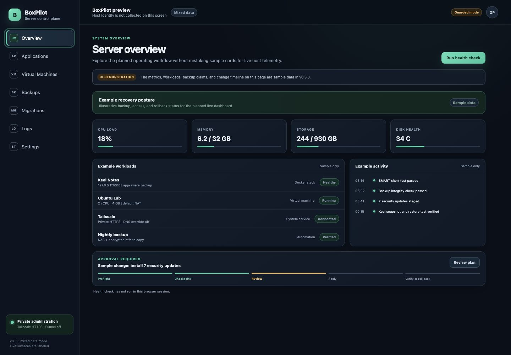

This is an actual `0.3.0` UI capture retained to show the workflow shell. The workload, health, backup, and activity values are demonstration data, and the interface labels them accordingly.

### BoxPilot controller backup approval mockup

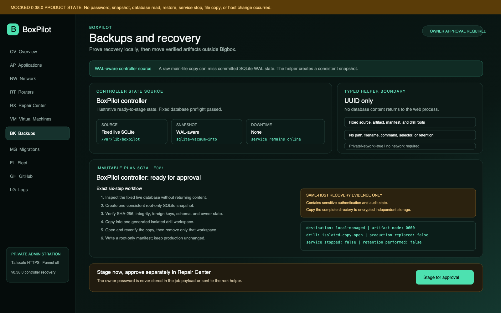

This explicitly disclosed `0.38.0` mock shows the fixed live SQLite source, no-downtime WAL-aware snapshot, checksum and database checks, separate copy-open drill, root-only artifact and manifest, UUID-only helper input, owner-password handoff, and the same-host limitation. No password, snapshot, database read, restore, service stop, file copy, or host state change occurred for the capture.

### Encrypted independent controller protection mockup

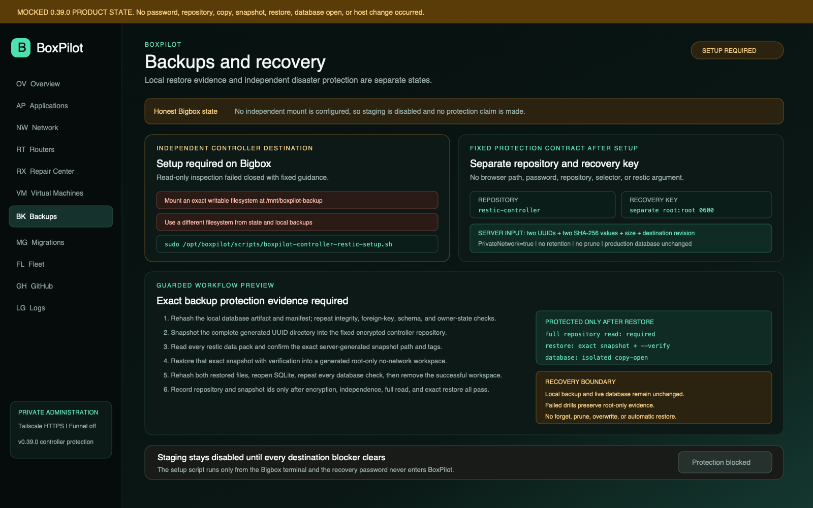

This explicitly disclosed `0.39.0` mock shows the separate fixed controller repository and recovery key, independent-filesystem gate, complete repository read, exact snapshot identity, restored artifact and manifest hashes, isolated SQLite copy-open drill, and no-retention boundary. It also shows the honest blocked state used when Bigbox has no independent mount. No password was entered, repository initialized, file copied, snapshot created, restore run, database opened, or host state changed for the capture.

### Encrypted independent application protection mockup

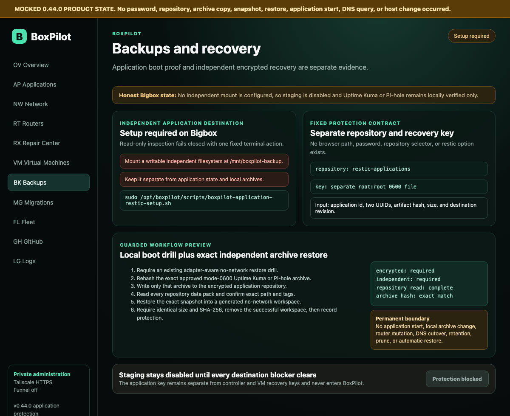

This explicitly disclosed `0.44.0` mock shows the separate fixed application repository and recovery key, independent-filesystem gate, required prior application-aware no-network drill, complete repository read, exact snapshot identity, restored archive hash, and no-retention boundary. It also shows the honest blocked state used when Bigbox has no independent mount. No password was entered, repository initialized, archive copied, snapshot created, restore run, application started, DNS query sent, or host state changed for the capture.

### Exact restic prerequisite repair mockup

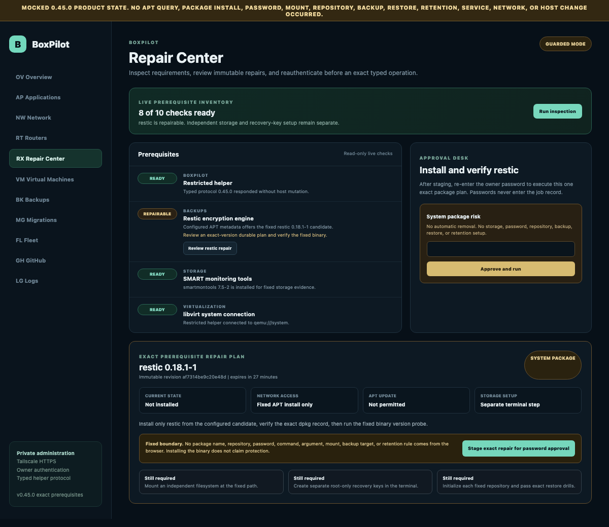

This explicitly disclosed `0.45.0` mock shows the read-only restic candidate check, immutable exact-version plan, separate staging and password-approval handoff, fixed package-only unit, and the honest remaining requirements for an independent mount, separately retained recovery keys, repository initialization, and exact restore drills. No APT query, package install, password entry, mount, repository, backup, restore, retention, service, network, or host change occurred for the capture.

### Fixed controller retention approval mockup

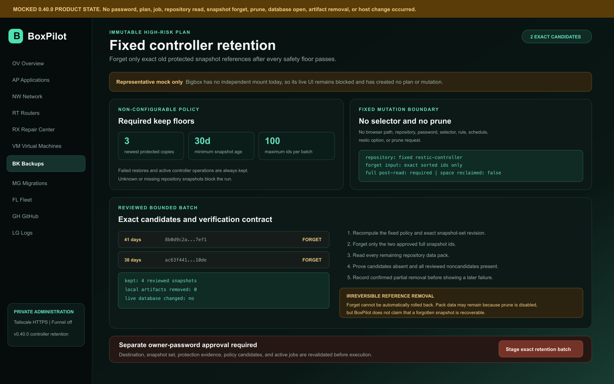

This explicitly disclosed `0.40.0` mock shows the three-copy and 30-day floors, exact reviewed candidates, complete post-forget repository read, durable partial-removal evidence, and the deliberate no-prune boundary. No password was entered, plan or job created, repository read, snapshot forgotten or pruned, database opened, artifact removed, or host state changed for the capture.

### Host-backed virtualization preflight

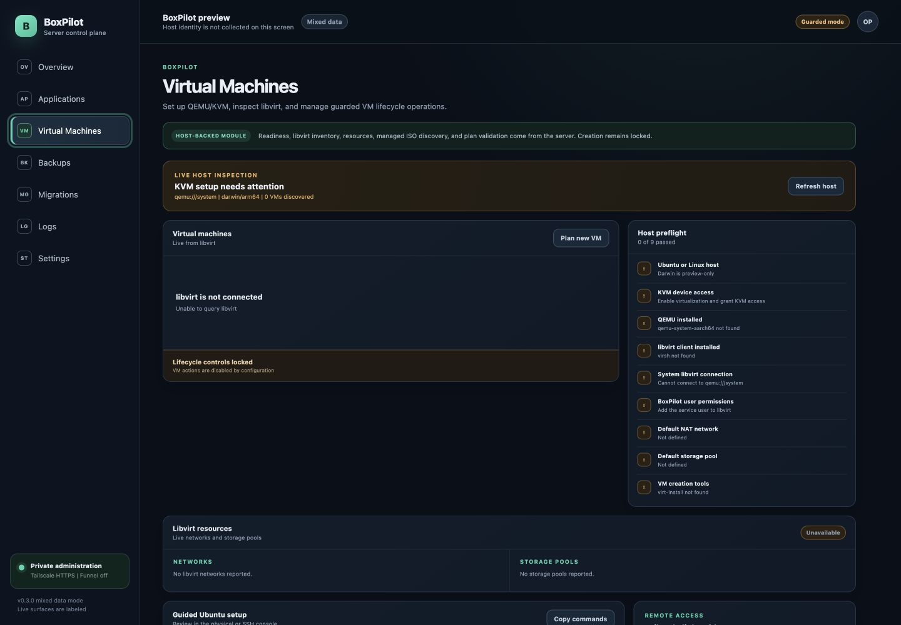

This is an actual host-backed capture from a non-Linux development machine. The failed checks are expected and demonstrate that the module reports missing KVM and libvirt dependencies instead of showing a false ready state.

### Earlier VM creation planner capture

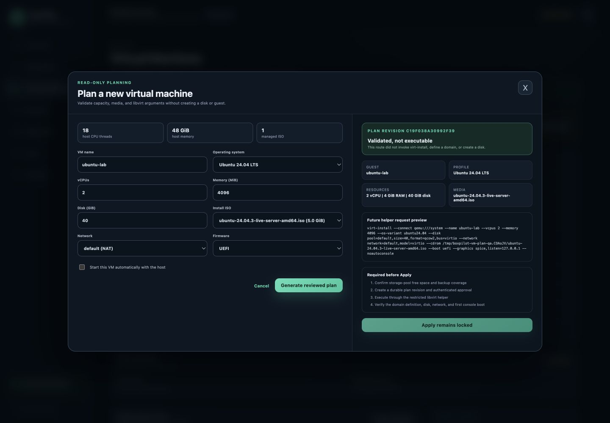

This older `0.3.0` capture uses a local development ISO fixture and shows the planning foundation before guarded execution shipped. In `0.9.0`, supported Linux plans can be staged for a separate password approval. The repository does not claim that this fixture created a VM.

### Guarded VM creation approval mockup

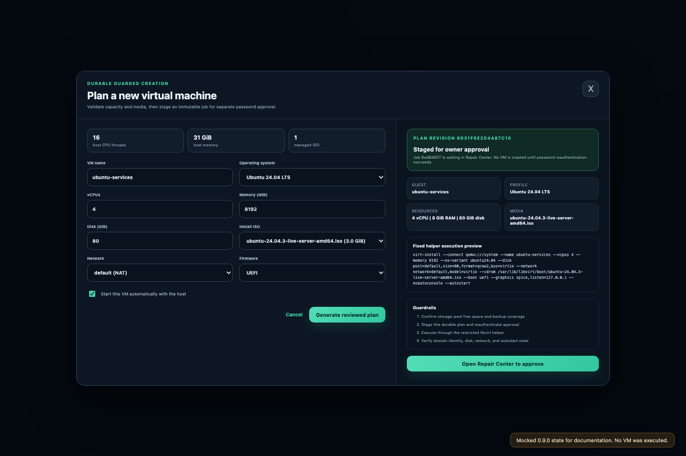

This `0.9.0` mock screenshot is rendered from the current BoxPilot styles and is explicitly labeled as mocked product state. It demonstrates the staged job, fixed helper preview, and handoff to Repair Center. No VM was created for the capture.

### Durable VM lifecycle approval mockup

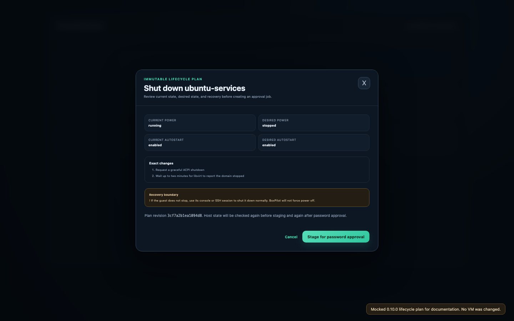

This explicitly disclosed `0.10.0` mock shows the exact current and desired state, recovery boundary, immutable revision, and separate approval handoff. The state is representative only. No VM was changed for the capture.

### Guarded offline snapshot approval mockup

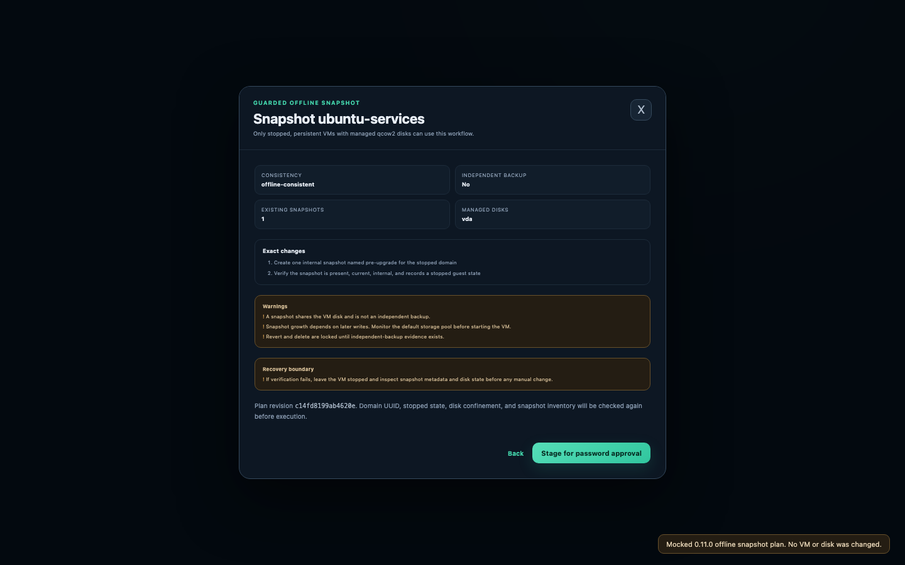

This explicitly disclosed `0.11.0` mock shows the offline-consistency label, independent-backup warning, managed disk target, immutable revision, and recovery boundary. The state is representative only. No VM or disk was changed for the capture.

### Stopped VM export approval mockup

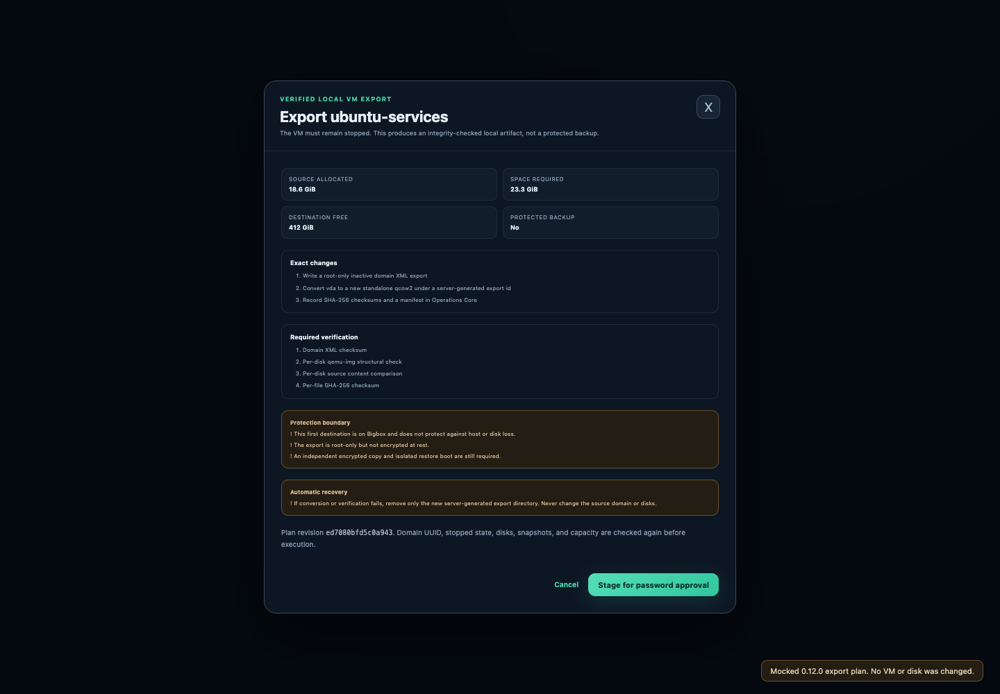

This explicitly disclosed `0.12.0` mock shows the capacity gate, fixed export changes, integrity checks, immutable revision, and protection boundary. It clearly labels the local artifact as unencrypted and not protected. No VM or disk was changed for the capture.

### Encrypted independent VM copy approval mockup

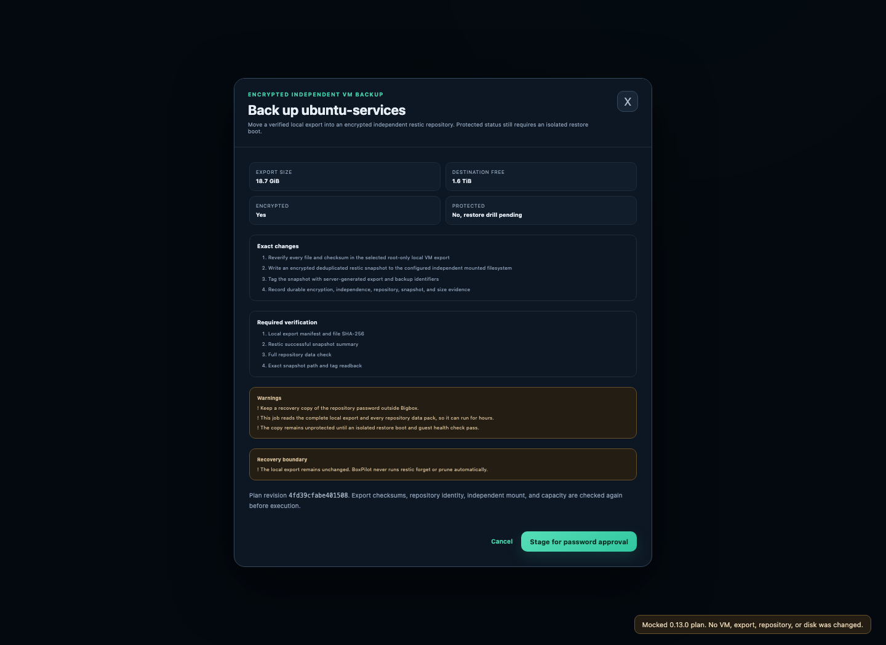

This explicitly disclosed `0.13.0` mock shows the fixed independent mount, encryption and capacity evidence, full repository verification, immutable revision, recovery-key warning, and the remaining restore boundary. No VM, export, repository, or disk was changed for the capture.

### Isolated VM restore drill approval mockup

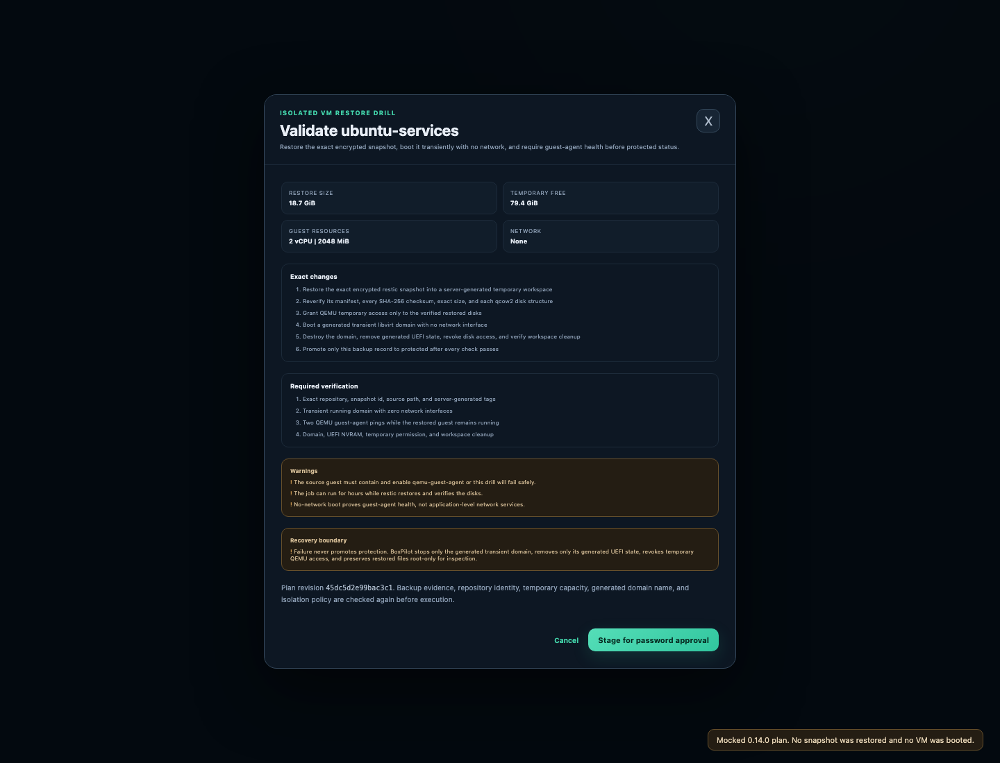

This explicitly disclosed `0.14.0` mock shows exact snapshot identity, temporary capacity, no-network transient boot, repeated guest-agent verification, QEMU permission and UEFI cleanup, and the protected-status gate. No snapshot was restored and no VM was booted for the capture.

### Guarded VM recovery-clone approval mockup

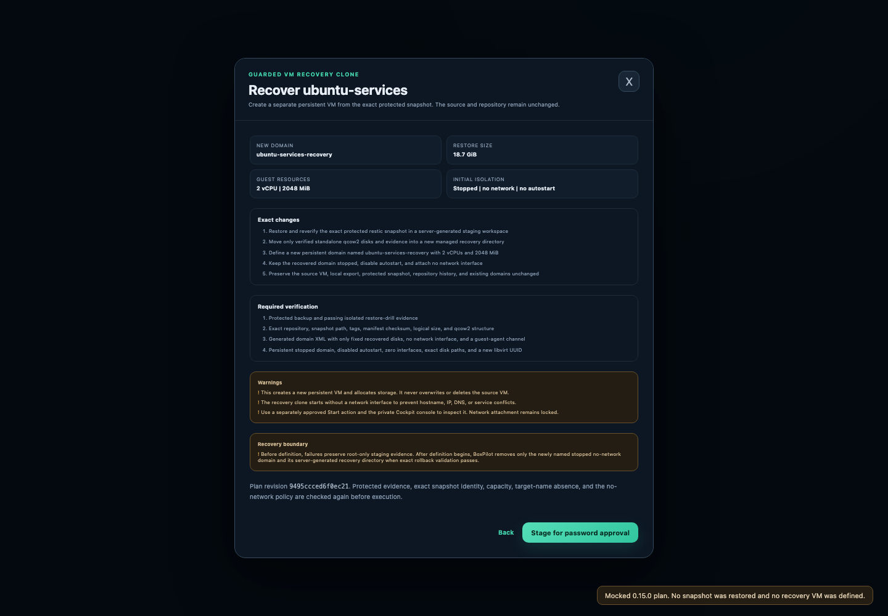

This explicitly disclosed `0.15.0` mock shows the separate target name, exact protected source evidence, fixed recovered storage, stopped persistent domain, disabled autostart, zero-network policy, immutable revision, and confined rollback. No snapshot was restored and no recovery VM was defined for the capture.

### Guarded VM backup-retention approval mockup

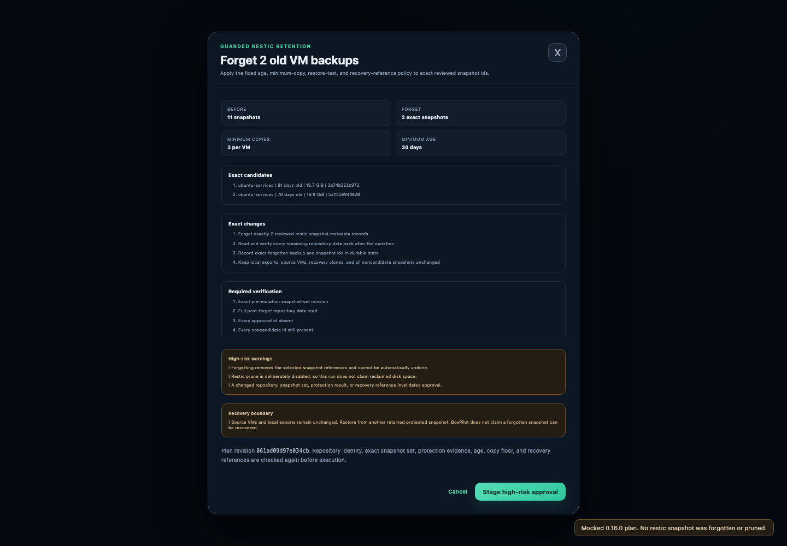

This explicitly disclosed `0.16.0` mock shows the fixed 30-day and three-copy floors, exact candidates, immutable snapshot-set revision, repository verification, high-risk approval, and no-prune boundary. No restic snapshot was forgotten or pruned for the capture.

### Guarded migration staging approval mockup

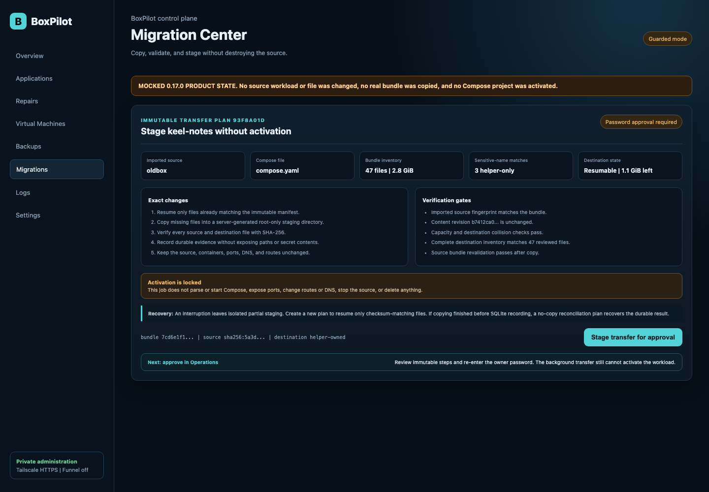

This explicitly disclosed `0.17.0` mock shows imported-source binding, immutable content revision, file and sensitive-name totals, exact SHA-256 verification, resume behavior, separate password approval, and the no-activation boundary. No source workload or file was changed, no real bundle was copied, and no Compose project was activated for the capture.

### Network and DNS assessment mockup

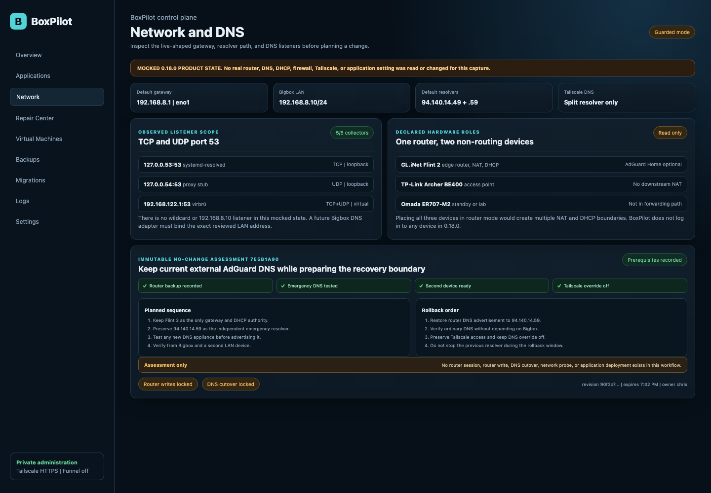

This explicitly disclosed `0.18.0` mock shows live-shaped gateway, Bigbox address, external AdGuard DNS, Tailscale split-DNS, port 53 scope, device roles, recovery gates, and the router-write and DNS-cutover locks. No router, DNS, DHCP, firewall, Tailscale, or application setting was read from a real browser session or changed for the capture.

### Guarded Pi-hole staging mockup

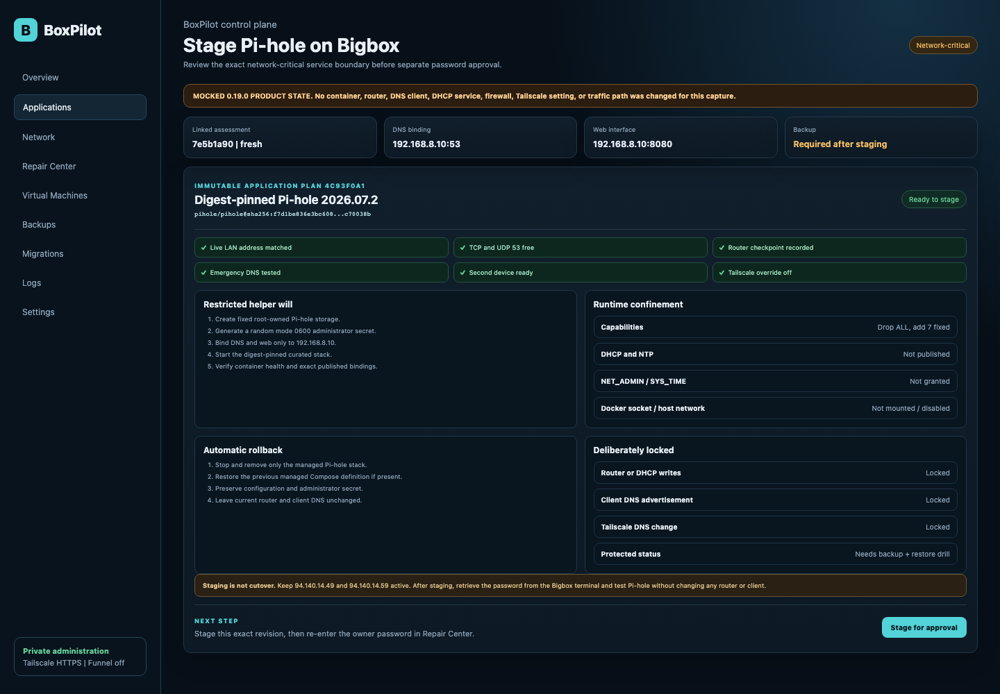

This explicitly disclosed `0.19.0` mock shows the linked network assessment, exact Bigbox LAN DNS and web bindings, root-only secret boundary, capability restrictions, health checks, backup-required state, and router, DHCP, client-DNS, and Tailscale cutover locks. No container, router, DNS client, DHCP service, firewall, Tailscale setting, or traffic path was changed for the capture.

### Pi-hole backup and isolated restore mockup

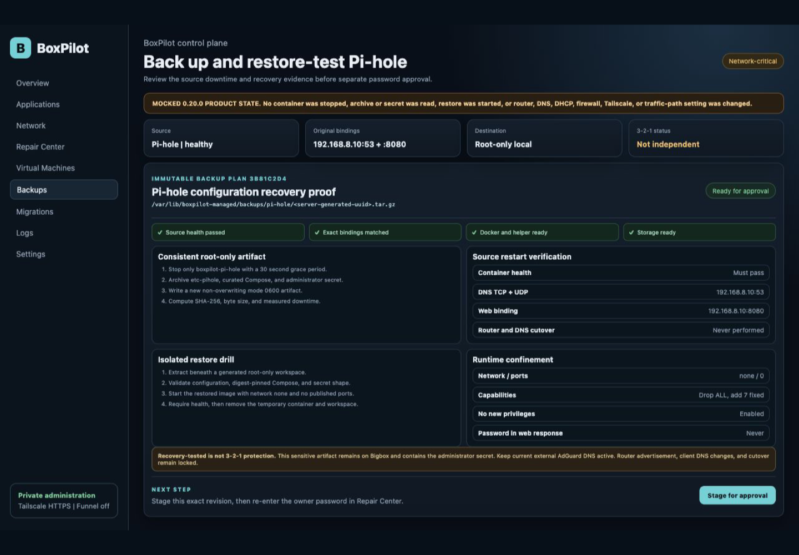

This explicitly disclosed `0.20.0` mock shows the clean-stop archive, root-only configuration and secret capture, source binding restart verification, SHA-256 evidence, temporary no-network restore container, local-destination limitation, and router and DNS cutover locks. No container was stopped, archive created, secret read, restore started, or network setting changed for the capture.

### Direct DNS acceptance mockup

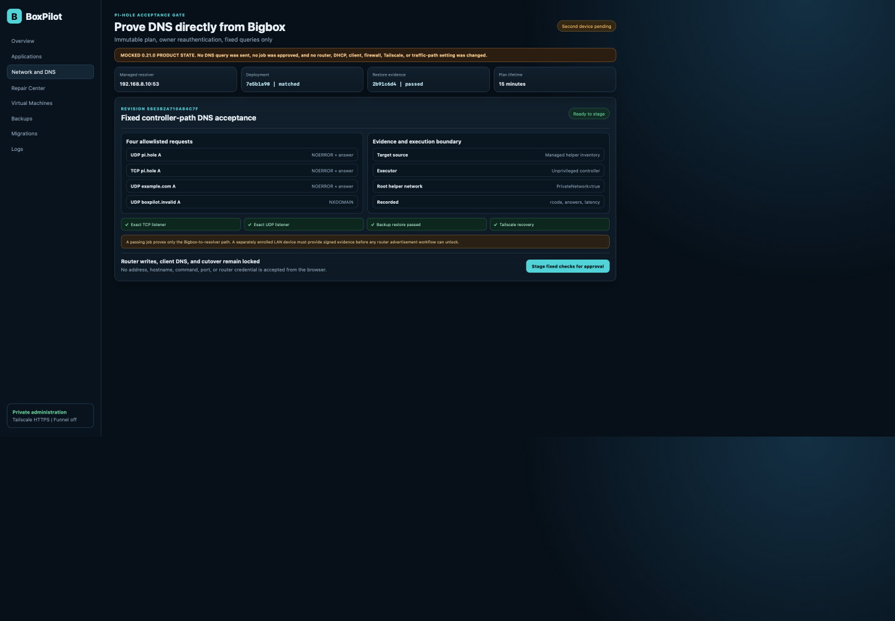

This explicitly disclosed `0.21.0` mock shows the exact managed resolver, linked deployment, assessment, and restore evidence, four fixed queries, durable response evidence, the unprivileged controller boundary, and the separate second-device gate. No DNS query was sent, no job was approved, and no router, DHCP, client, firewall, Tailscale, or traffic-path setting was changed for the capture.

### Signed fleet-agent mockup

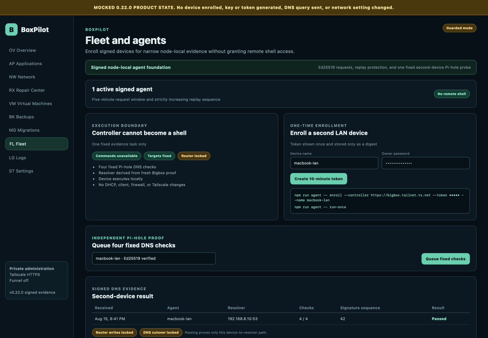

This explicitly disclosed `0.22.0` mock shows one-time enrollment, device-owned Ed25519 identity, the no-shell execution boundary, one fixed Pi-hole task, replay-protected evidence, and the remaining router and cutover locks. No device was enrolled, no key or token was generated, no DNS query was sent, and no network setting was changed for the capture.

### Signed Flint 2 second-device acceptance mockup

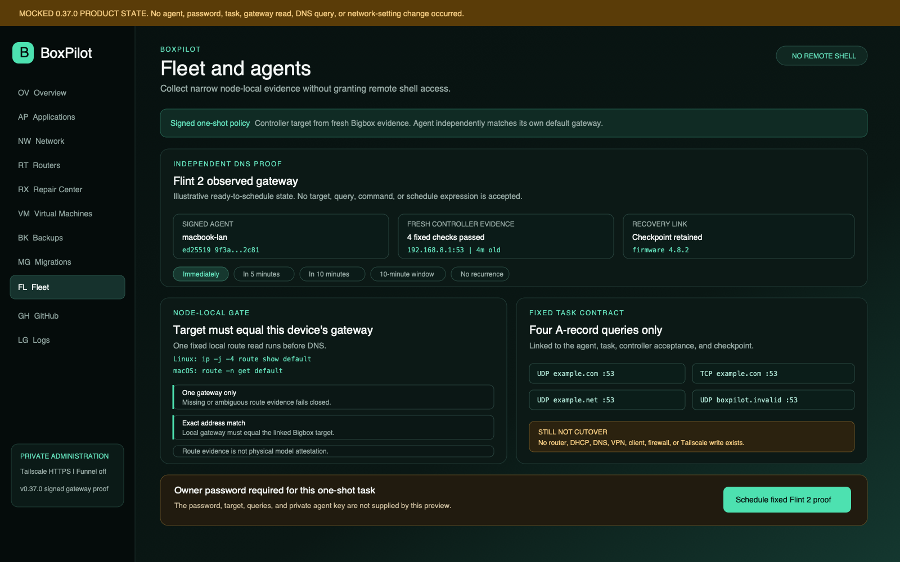

This explicitly disclosed `0.37.0` mock shows a fresh linked Bigbox acceptance, owner-approved one-shot window, signed agent identity, node-local default-gateway match, four fixed queries, and the remaining model-attestation, configuration, DHCP-advertisement, router-write, and cutover locks. No agent was enrolled, password entered, task scheduled, gateway inspected, DNS query sent, or router, AdGuard Home, DHCP, DNS advertisement, VPN, client, firewall, or Tailscale setting read or changed for the mock.

### One-shot fleet policy mockup

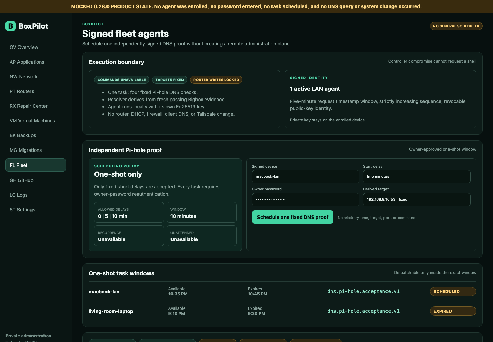

This explicitly disclosed `0.28.0` mock shows the immediate, 5-minute, and 10-minute fixed delay policy, exact ten-minute execution window, owner reauthentication, derived target, task ledger, and the recurrence, unattended, command, target, package, router, and cutover locks. No agent was enrolled, no password entered, no task scheduled, and no DNS query or system change occurred for the capture.

### Router checkpoint mockup

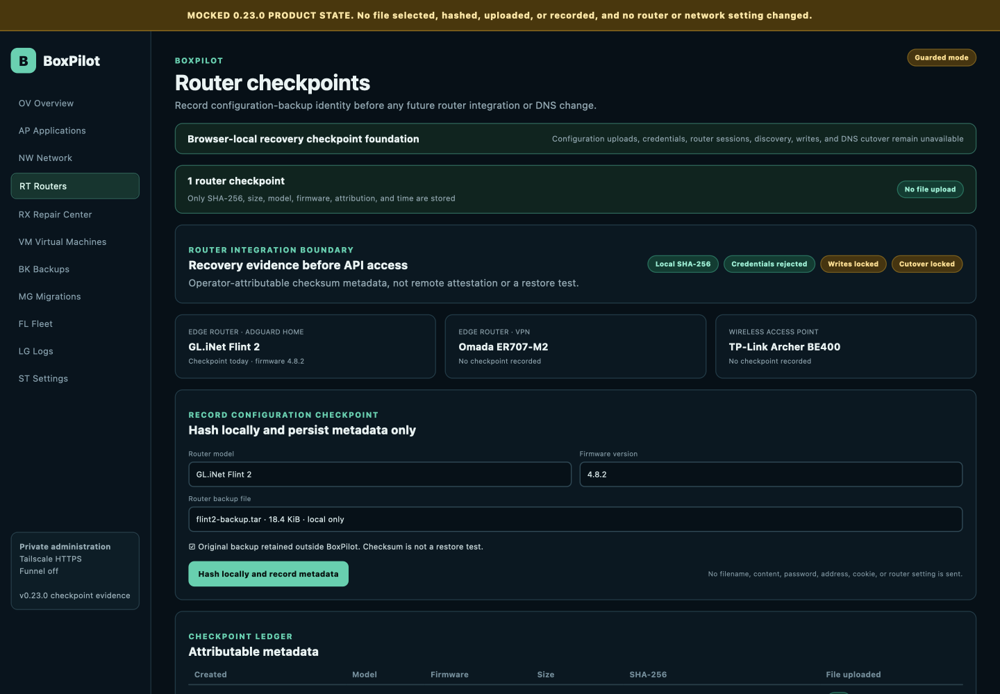

This explicitly disclosed `0.23.0` mock shows supported device declarations, local file hashing, metadata-only persistence, the operator-retention assertion, and the remaining credential, router-write, restore, and DNS-cutover locks. No file was selected, hashed, or uploaded, no checkpoint was recorded, and no router or network setting was read or changed for the capture.

### Router readiness mockup

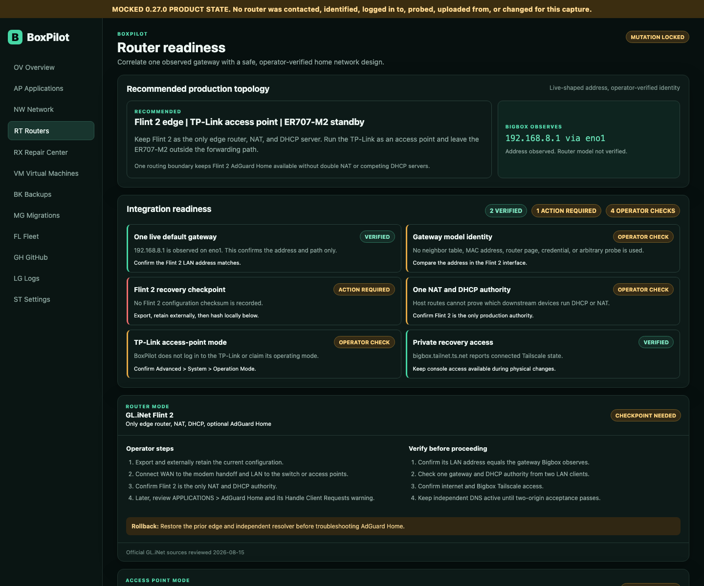

This explicitly disclosed `0.27.0` mock shows the recommended Flint 2 edge, TP-Link access-point, and ER707-M2 standby topology, a live-shaped gateway-address correlation, checkpoint coverage, operator checks, model-specific handholding, and the credential, discovery, probe, upload, DHCP, DNS, Tailscale, and router-write locks. No router was contacted, identified, logged in to, probed, uploaded from, or changed for the capture.

### Flint 2 AdGuard Home direct acceptance mockup

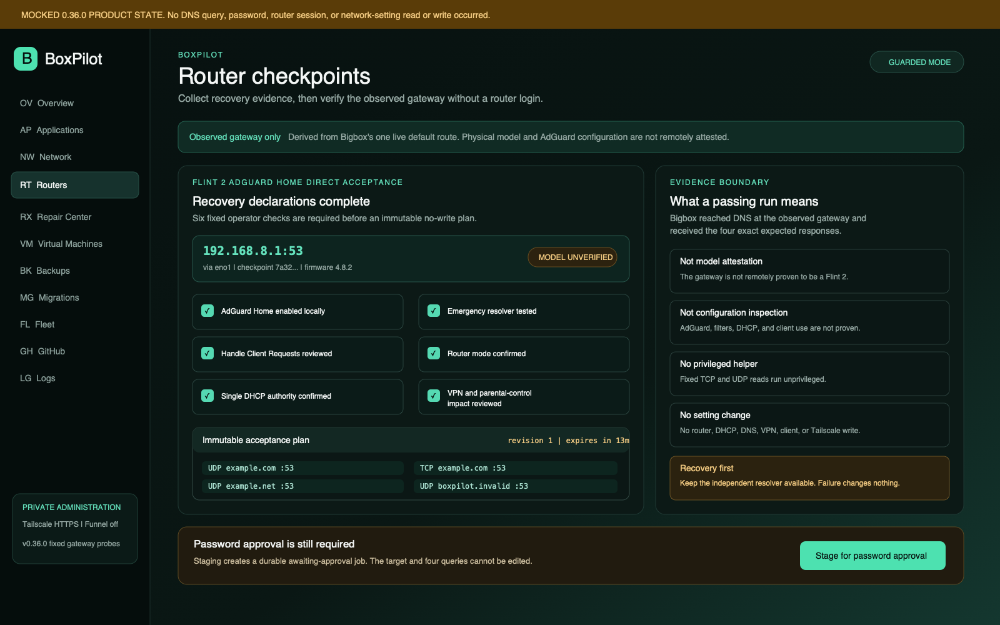

This explicitly disclosed `0.36.0` mock shows the observed-only gateway target, retained checkpoint, six operator declarations, four fixed queries, immutable plan, password-approval handoff, and the remaining model-attestation, configuration, DHCP-advertisement, client-path, and router-write locks. No DNS query was sent, no password was entered, and no router, AdGuard Home, DHCP, DNS advertisement, VPN, client, firewall, or Tailscale setting was read or changed for the mock.

### GitHub provenance mockup

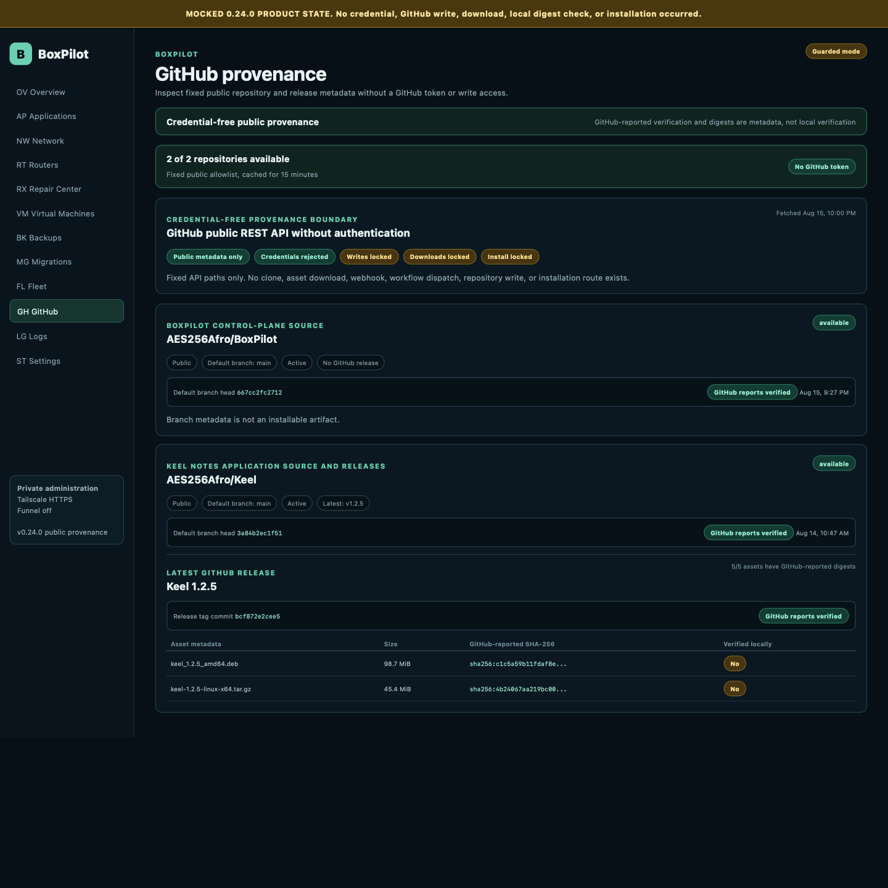

This explicitly disclosed `0.24.0` mock shows fixed public repository heads, GitHub-reported verification, Keel release-asset digest metadata, and the remaining token, write, download, local-verification, and installation locks. No credential was accepted, repository or workflow was changed, asset was downloaded, digest was verified locally, or software was installed for the capture.

### Keel Notes artifact acquisition mockup

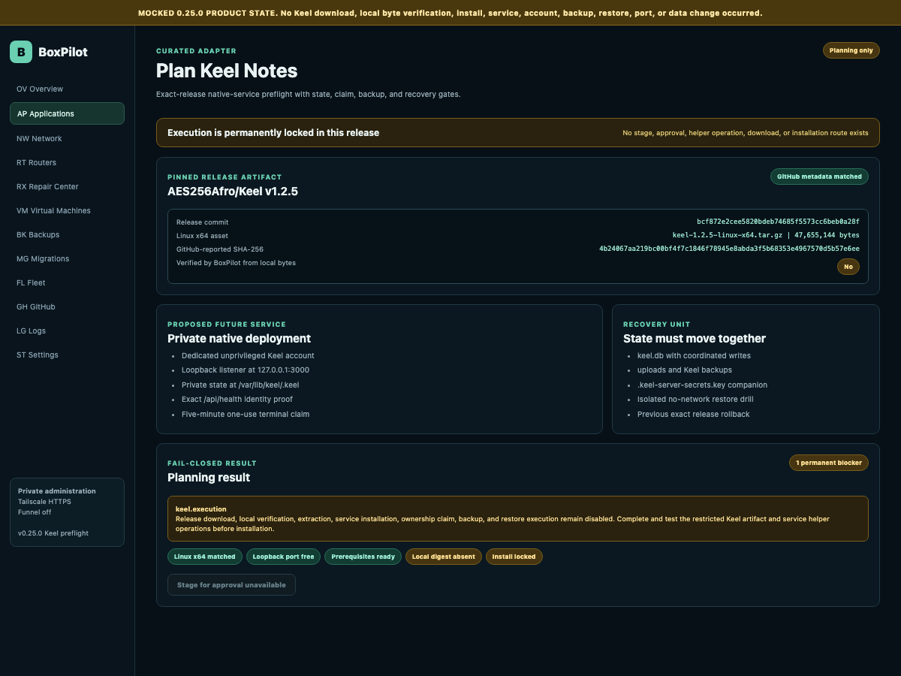

This explicitly disclosed `0.43.0` mock shows the fixed release identity, complete local-byte verification as a modeled precondition, 2,900 logical members, the one symbolic-link and absolute-target blockers, and the enforced extraction lock. It illustrates verified evidence in a mock UI only: no request, password, marker, archive, extraction, application tree, account, service, container, port, or data change occurred for the capture.

### Disaster recovery kit mockup

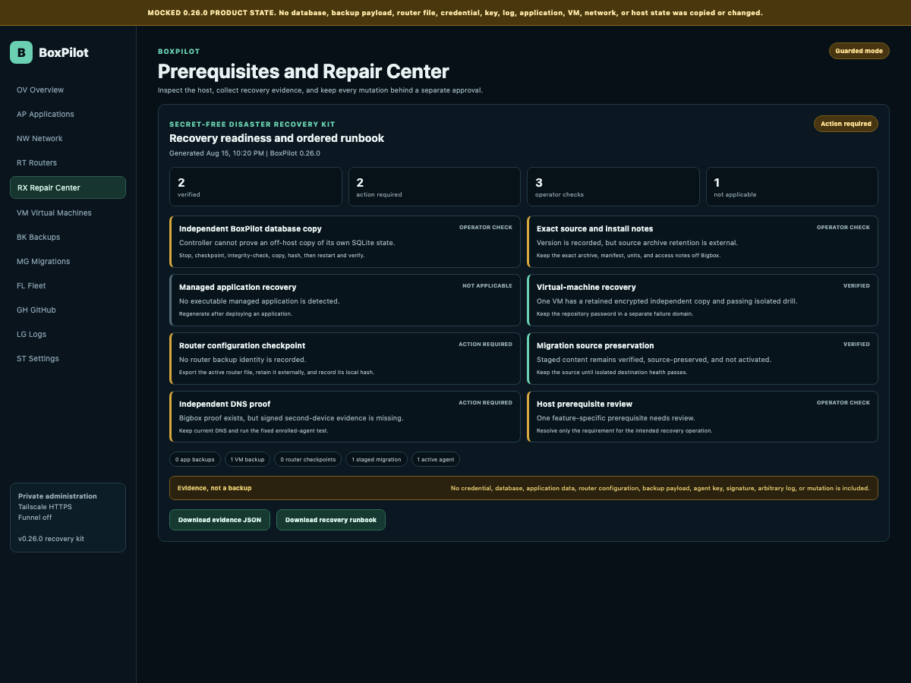

This explicitly disclosed `0.26.0` mock shows correlated readiness checks, evidence counts, export controls, and the evidence-not-backup boundary. No database, application data, backup payload, router configuration, credential, key, signature, or log was copied, and no host, VM, application, network, or router state was changed for the capture.

### Local Action Center mockup

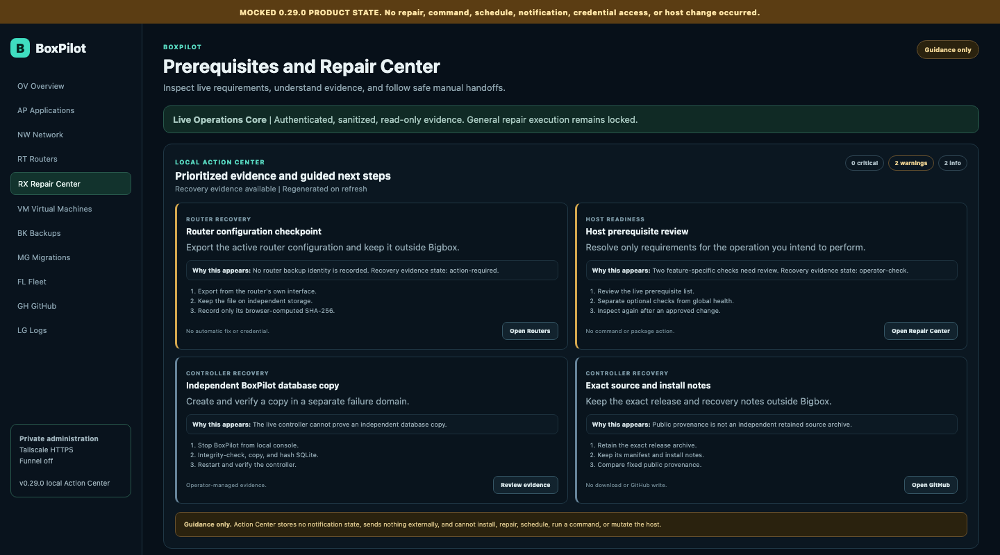

This explicitly disclosed `0.29.0` mock shows fixed severity, sanitized evidence, manual three-step guidance, and in-product navigation. No repair, command, package operation, schedule, notification, credential access, log collection, or host, VM, application, network, DNS, Tailscale, or router change occurred for the capture.

### Storage and filesystem evidence mockup

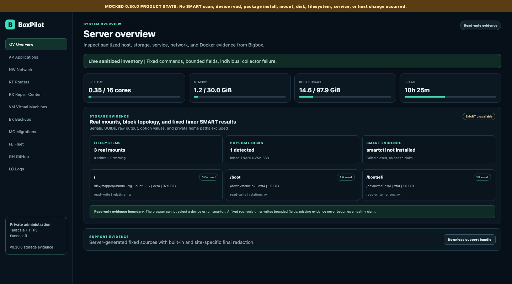

This explicitly disclosed `0.30.0` mock shows real-mount capacity, sanitized block topology, fail-closed missing SMART evidence, the separate root-only timer boundary, and server-generated support redaction. No SMART scan, device read, package installation, mount, filesystem, disk, service, or host state was triggered or changed for the capture.

### Exact smartmontools repair mockup

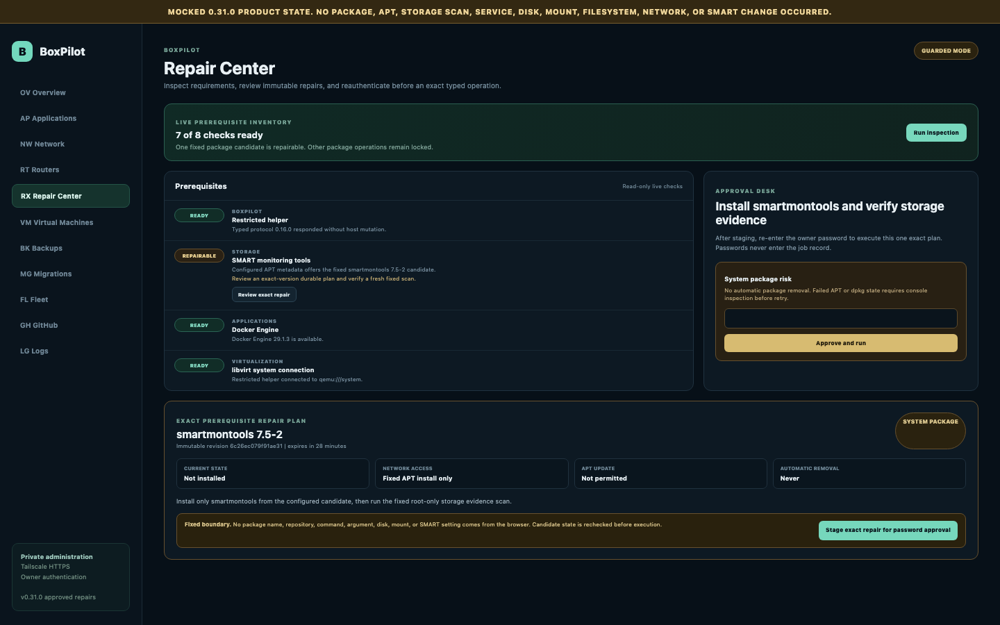

This explicitly disclosed `0.31.0` mock shows the fixed package candidate, immutable revision, network and rollback disclosures, separate staging, and password-approval handoff. No package metadata was queried, package was installed or removed, APT operation ran, storage scan occurred, or host, disk, mount, filesystem, service, network, or SMART setting changed for the capture.

### Filesystem error evidence mockup

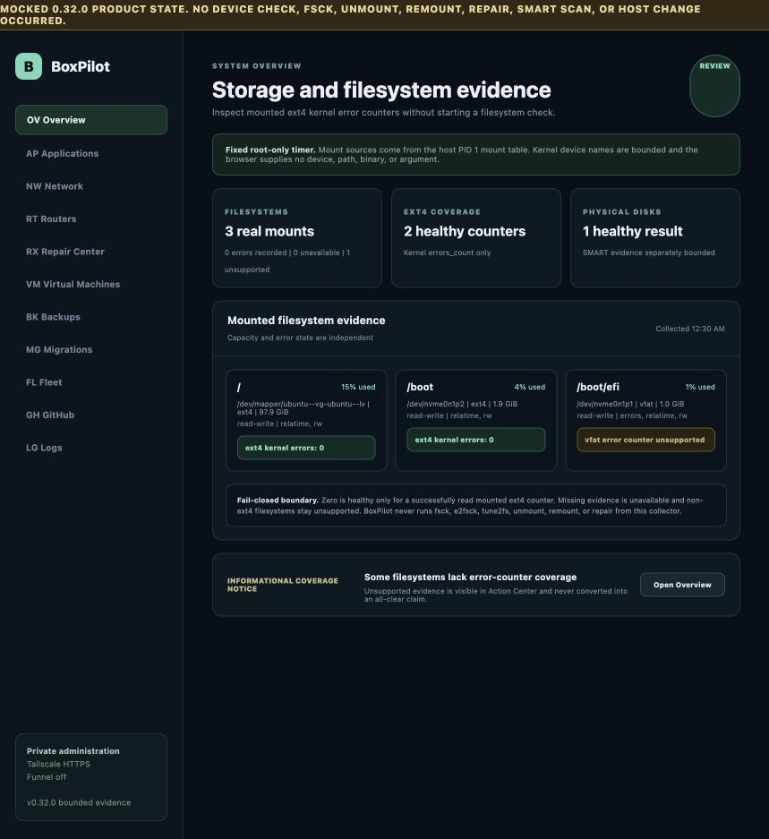

This explicitly disclosed `0.32.0` mock shows independent capacity and ext4 error state, zero-error evidence for two mounted ext4 filesystems, explicit unsupported vfat coverage, and the read-only Action Center handoff. No device check, fsck, unmount, remount, repair, SMART scan, service, disk, mount, filesystem, or host state was triggered or changed for the capture.

### UPS power evidence mockup

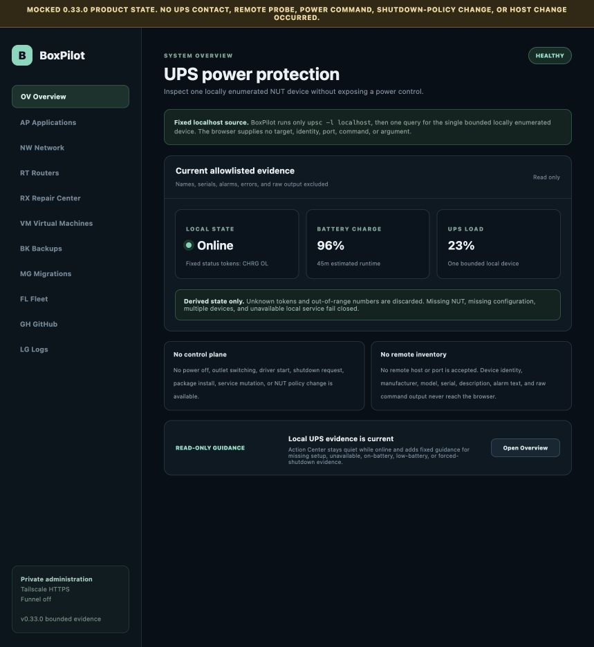

This explicitly disclosed `0.33.0` mock shows the allowlisted local NUT state, charge, runtime, load, and read-only Action Center handoff. No UPS was contacted, remote target was probed, raw output or device identity was collected, power command ran, shutdown policy changed, or host state changed for the capture.

### Host maintenance evidence mockup

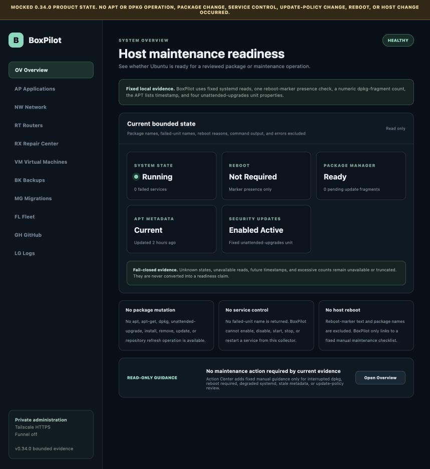

This explicitly disclosed `0.34.0` mock shows derived system state, failed-service count, reboot marker presence, dpkg fragment count, APT metadata age, unattended-upgrades state, and the read-only Action Center handoff. No package or unit name was read into the mock, APT or dpkg operation ran, package changed, service restarted, update policy changed, reboot occurred, or host state changed for the capture.

### Exact APT metadata refresh mockup

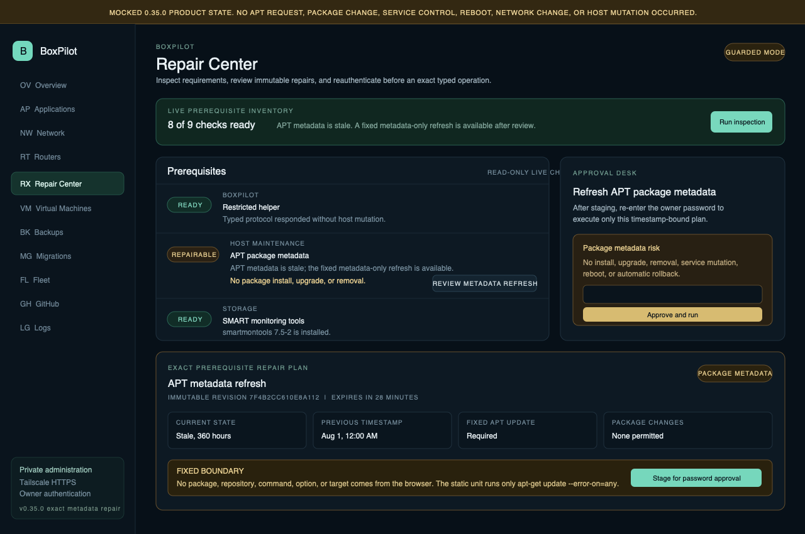

This explicitly disclosed `0.35.0` mock shows a stale metadata prerequisite, immutable timestamp-bound plan, fixed update-only boundary, package-change prohibition, separate staging, and password-approval handoff. No APT request, package change, service control, reboot, network change, or host mutation occurred for the mock.

## Safety contract

Every future host change must follow:

1. Plan
2. Dry run
3. Checkpoint
4. Explicit approval
5. Apply with streamed logs
6. Verify or roll back

The exact `smartmontools` repair, fixed APT metadata refresh, WAL-aware controller backup, encrypted independent controller protection, Pi-hole staging and backup, migration staging, VM creation, lifecycle changes, offline snapshots, stopped-VM exports, encrypted independent VM copies, isolated restore drills, guarded recovery clones, and exact retention batches use the durable job executor and separate typed helper operations. The helper derives its own controller database, package and metadata units, approval markers, application, secret, backup, manifest, restore-drill, migration inbox, staging, binary, libvirt URI, managed-media, disk, export, recovery, UEFI NVRAM, mount, repository, cache, and password-file roots, verbs, and argument arrays; the web process cannot supply them. Pi-hole and Flint 2 gateway direct DNS acceptance also use durable password approval, but their four fixed network reads run in the unprivileged controller so the main root helper keeps `PrivateNetwork=true`. The signed fleet agent accepts only the fixed Pi-hole or Flint 2 four-query contract; Flint 2 additionally requires its own one unambiguous local IPv4 default gateway to match the controller target. It never exposes a shell or operator-supplied target. Every supported mutation requires an immutable plan and owner password reauthentication. Higher-impact operations remain locked until each handler has authorization, path confinement, rollback, and negative tests. BoxPilot will not provide an arbitrary root shell.

## Run for development

Requirements:

- Node.js 24 or newer
- npm 11 or newer

```bash
npm install
npm run dev
```

Open `http://127.0.0.1:5173`.

## Run the production build

```bash
npm install
npm run build
npm start
```

Open `http://127.0.0.1:8787`. The server binds to loopback unless `BOXPILOT_HOST` is explicitly changed.

On a fresh instance, generate the short-lived owner token from the server terminal, then finish setup in the browser:

```bash
npm run owner:token
```

Health endpoint:

```bash
curl http://127.0.0.1:8787/api/v1/health
```

On Ubuntu, a native service is required for live libvirt access. Follow [QEMU/KVM setup and operation](docs/VIRTUALIZATION.md) after the base operating-system installation.

## Run with Docker

```bash
docker compose up -d --build
docker compose ps
curl http://127.0.0.1:8787/api/v1/health
```

The Compose stack:

- Publishes only to `127.0.0.1`
- Runs as the unprivileged Node user
- Drops every Linux capability
- Enables `no-new-privileges`
- Uses a read-only root filesystem
- Does not mount host directories or the Docker socket
- Stores preview authentication state only in its temporary filesystem

The default container is the safest preview deployment, but its owner and job database is intentionally ephemeral and it cannot inspect host libvirt because it has no libvirt client or socket. Do not add `/run/libvirt` or the Docker socket to this container. Use the documented native system services for persistent Operations Core and VM support.

## Private Tailscale access

After BoxPilot is healthy on the Ubuntu server, publish it privately to the tailnet:

```bash
sudo tailscale serve --bg http://127.0.0.1:8787
tailscale serve status
```

Open the HTTPS URL shown by `tailscale serve status` from another device on the same tailnet. Keep Tailscale Funnel disabled. BoxPilot authentication remains required because tailnet membership alone is not application authorization.

## Validation

```bash
npm run check
npm run doctor
docker build -t boxpilot:local .
```

## Documentation

- [Architecture and security boundaries](docs/ARCHITECTURE.md)
- [Operations Core setup and recovery](docs/OPERATIONS-CORE.md)
- [Exact prerequisite repair boundary](docs/PREREQUISITE-REPAIRS.md)
- [Curated application planning and deployment](docs/APPLICATIONS.md)
- [Verified backup and isolated restore workflow](docs/BACKUPS.md)
- [WAL-aware local and encrypted independent BoxPilot controller recovery runbook](docs/CONTROLLER-BACKUPS.md)
- [Sanitized host, Docker, service, and log inventory](docs/INVENTORY.md)
- [Router, DNS topology, and guarded direct acceptance](docs/NETWORK.md)
- [Router checkpoint evidence and future adapter gates](docs/ROUTERS.md)
- [Signed fleet agents and independent DNS evidence](docs/FLEET.md)
- [Credential-free GitHub provenance and installation gates](docs/GITHUB.md)
- [Keel Notes discovery, inert exact-release acquisition, and execution gates](docs/KEEL.md)
- [Disaster recovery readiness kit and runbook](docs/RECOVERY.md)
- [Guarded migration discovery and local staging](docs/MIGRATIONS.md)
- [Dependency-ordered roadmap](docs/ROADMAP.md)
- [QEMU/KVM setup and operation](docs/VIRTUALIZATION.md)
- [QEMU/KVM milestones](docs/VIRTUALIZATION-MILESTONES.md)
- [QEMU/KVM API and agent contract](docs/VIRTUALIZATION-API.md)
- [Ubuntu Server installation runbook](UBUNTU-SERVER-INSTALL-RUNBOOK.md)

## Keel Notes discovery and inert artifact adapter

Version `0.25.0` ships the first Keel-specific adapter as a non-executable planning boundary. Version `0.41.0` adds parameter-free read-only discovery of the supported per-user Linux layout, fixed Docker identity and persistence signals, port 3000 exposure, and exact Keel health identity without returning private paths or reading application secrets. Version `0.42.0` adds a separate guarded acquisition plan for only one exact [Keel Notes](https://github.com/AES256Afro/Keel) Linux x64 release identity. Version `0.43.0` adds runtime archive membership inspection and correctly blocks that release because it includes one absolute build-workspace symbolic link. The root-only archive remains inert and the deployment plan remains blocked. See [the Keel adapter guide](docs/KEEL.md) for the evidence and the corrected-release gate.

The generic migration packer still treats an offline Keel Compose project as opaque verified files. It does not yet coordinate the Keel database, managed-secret key, uploads, service health, account claim, activation, or cutover.

## License

No license has been selected yet. All rights are reserved until the repository owner chooses one.
