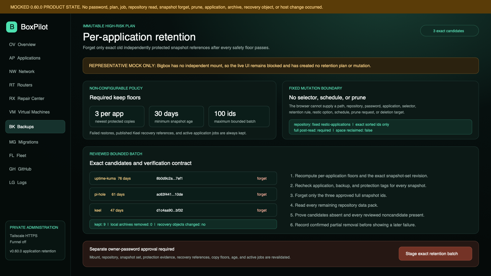
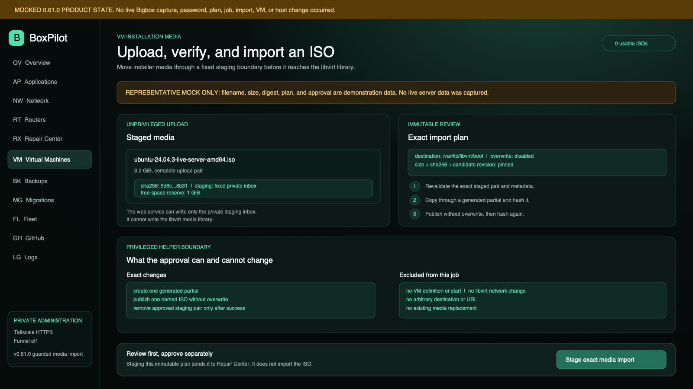
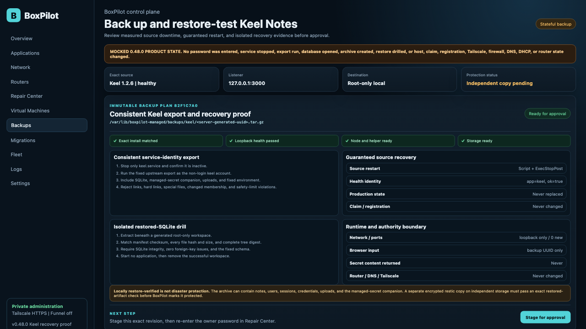
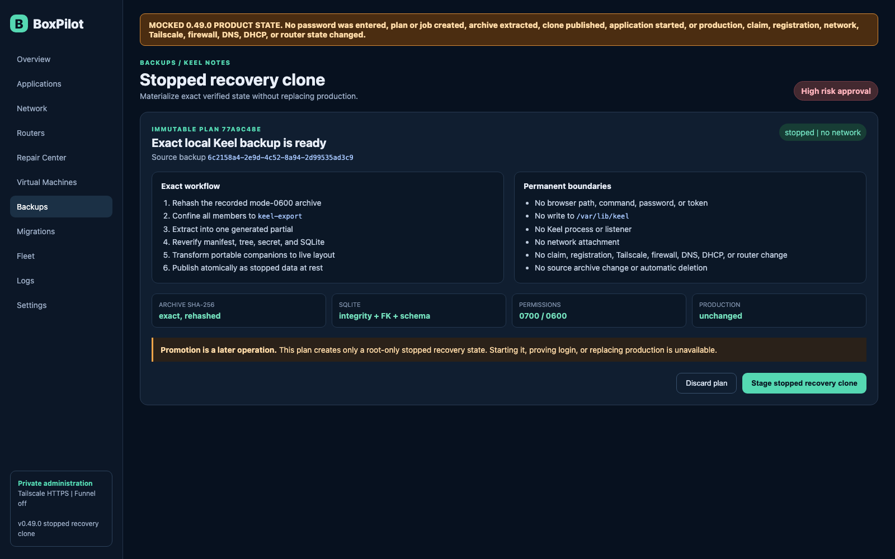
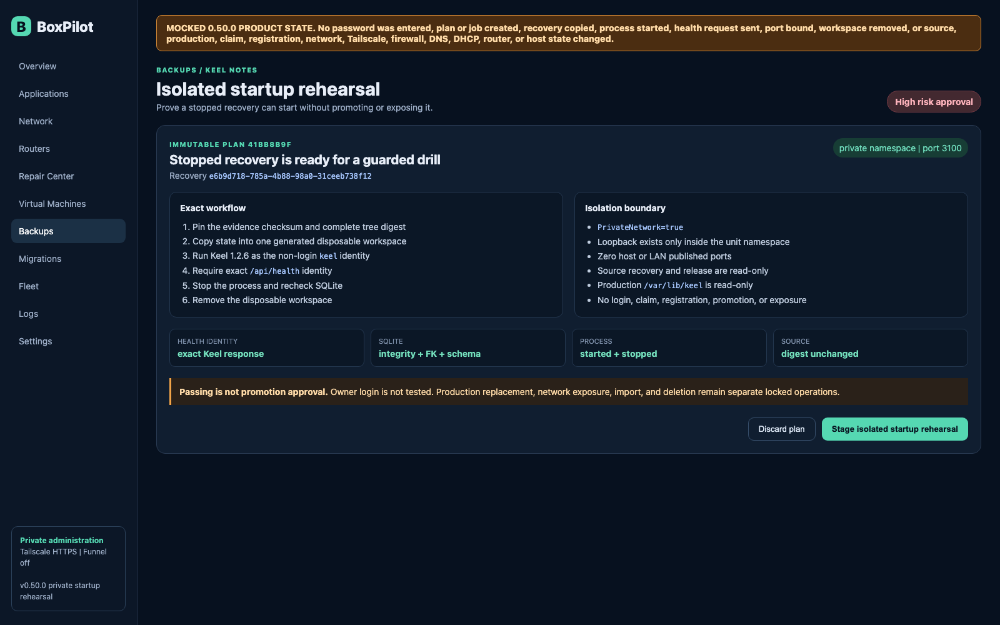
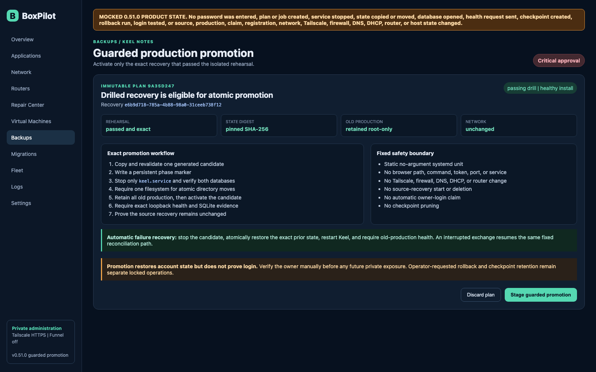
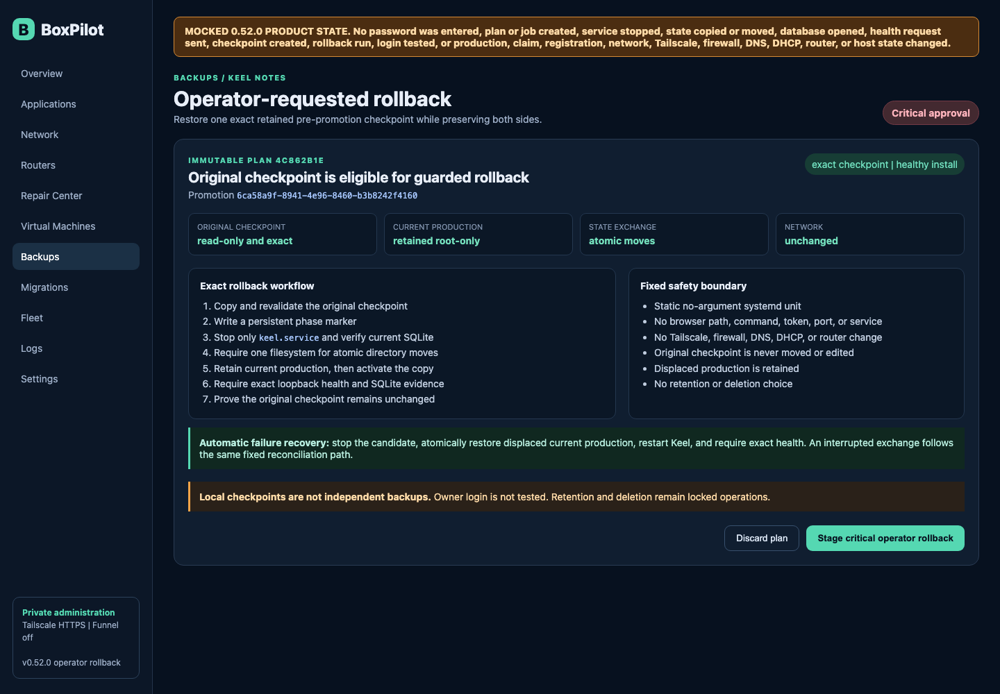
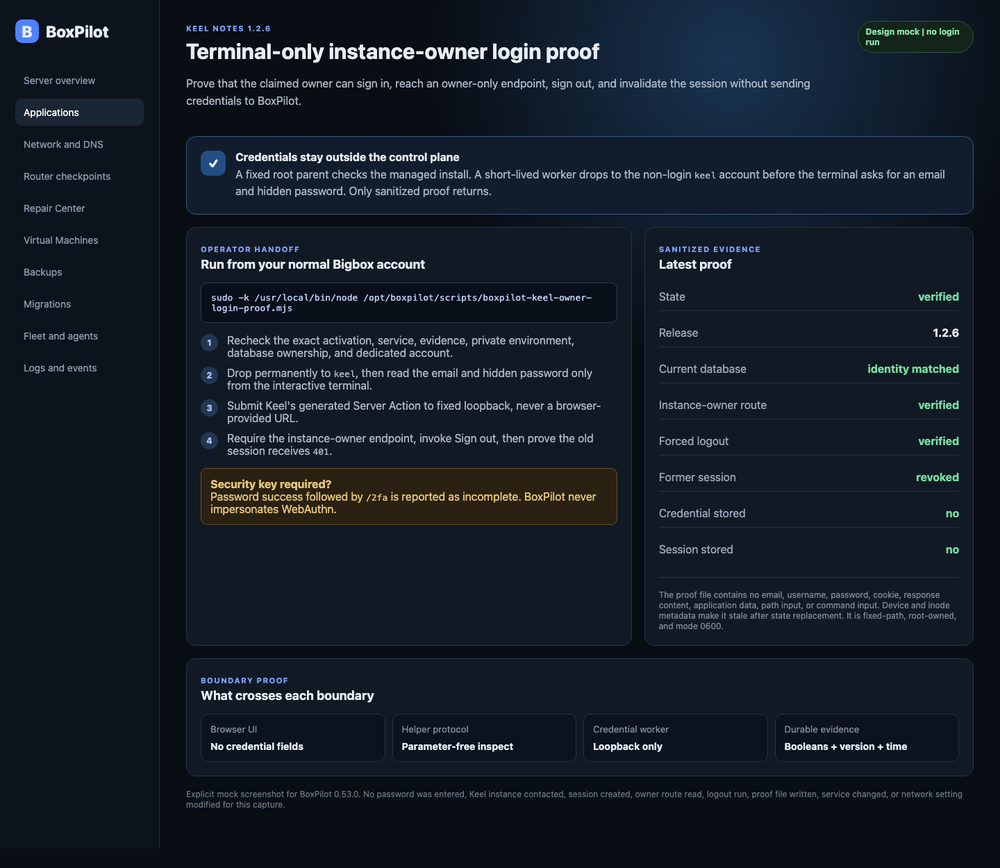

# BoxPilot

BoxPilot is an early, safety-first control plane for an Ubuntu home server. The long-term product is a guided interface for applications, backups, logs, imports, migrations, Docker workloads, routers, agents, and virtual machines over a private LAN or Tailscale connection.

## Current status

Version `0.40.0` adds one fixed evidence-gated retention policy for independently protected BoxPilot controller snapshots. It keeps at least the three newest active protected snapshots, every snapshot younger than 30 days, every unprotected or failed-restore record, and every snapshot used by an active controller operation. One high-risk immutable plan can forget at most 100 exact reviewed snapshot ids. The restricted helper revalidates the fixed mount, repository identity, destination revision, complete snapshot set, protection evidence, and candidate set; runs `restic forget` only for those exact ids; reads every remaining repository data pack; proves the candidates absent and every reviewed noncandidate present; and durably records confirmed partial removal if later verification fails. It never accepts a browser path, repository, password, selector, retention rule, restic option, schedule, or prune request. It never runs `restic prune`, reclaims space, changes the live database, removes local artifacts, or claims production-restore retention. Version `0.40.1` corrects the Backups data-source disclosure so it accurately distinguishes the shipped independent controller workflow from still-pending independent application destinations. The server still has no independent mount configured, so the live UI remains honestly blocked and creates no automatic retention plan or mutation.

Version `0.41.0` adds parameter-free read-only Keel Notes discovery before any executable installer work. The restricted helper recognizes the supported per-user Linux install and systemd user-unit shape, fixed Docker identity signals, persistent `/data` coverage, port 3000 exposure, and the exact unauthenticated `/api/health` identity. It returns bounded booleans, counts, fixed source labels, version, and risk identifiers. It never accepts a path, port, service, container, command, or URL and never reads `.env`, database contents, secret-key contents, container environments, host mount sources, usernames, or private paths. Changed, duplicate, unsafe, incomplete, or stale evidence fails closed. Download, local artifact verification, install, adoption, claim, backup, restore, import, exposure, and service or container mutation remain locked.

Version `0.42.0` adds the first executable Keel gate without installing Keel. An authenticated owner can create an empty-input immutable plan and stage a password-approved durable job for one compiled release identity. The network-isolated main root helper accepts only a server-generated acquisition UUID, writes a five-minute root-only marker, and starts a separately sandboxed static one-shot. That unit follows only the reviewed HTTPS GitHub release redirect, requires the exact 47,655,144-byte response, computes the complete local SHA-256, and publishes a root-only archive plus acquisition evidence atomically. Changed bytes, length, scheme, host, redirect shape, marker, file type, or existing artifact state fail closed. Partial files are removed on failure. No browser URL, path, filename, digest, redirect, command, or argument is accepted. The archive is not returned, extracted, executed, installed, started, claimed, exposed, imported, backed up, or restored.

Version `0.43.0` adds a parameter-free runtime membership inspector for that exact root-only archive. It verifies the compressed size and SHA-256 again, streams gzip and tar data under fixed member and uncompressed-size limits, validates tar checksums, understands bounded GNU long-name metadata, requires one exact root and the pinned logical entry count, and rejects traversal, absolute or backslash paths, duplicates, links, devices, FIFOs, unknown types, unsupported metadata, malformed structure, or changed bytes. It returns only counts and fixed risk identifiers. It never extracts a member or returns a member name, link target, or member content. The then-pinned Keel 1.2.5 asset was correctly blocked because its 2,900 logical entries included one symbolic link with an absolute GitHub Actions build-workspace target. BoxPilot did not follow, rewrite, omit, or extract that link. The corrected upstream 1.2.6 release used by version 0.46.0 passes the same gate.

Version `0.44.0` closes the independent-destination gap for verified Uptime Kuma and Pi-hole archives. A new fixed `restic-applications` repository uses its own recovery password, separate from controller and VM keys, on the exact independently mounted filesystem. An immutable plan pins the application id, two server-generated UUIDs, approved archive SHA-256 and size, and destination revision. After password approval, the network-isolated helper rechecks the mode-0600 archive, writes only that exact file, reads every restic data pack, verifies the exact snapshot path and tags, restores it into a generated root-only no-network workspace, and requires the restored size and SHA-256 to match before recording protection. The earlier adapter-aware no-network container drill remains required. No browser path, password, repository selector, restic option, application start, router mutation, DNS cutover, retention, prune, overwrite, or automatic restore is available. The server currently has no independent mount configured, so its live destination remains honestly blocked and no protection job can be staged.

Version `0.45.0` adds the prerequisite that those fixed encrypted repositories share: a separately named exact-version `restic` package repair in Repair Center. A parameter-free inspection reads only bounded dpkg and configured APT candidate evidence. The empty-input immutable plan captures the exact version and installed state, then requires staging and owner-password approval. If the package is absent, the network-isolated helper writes a short-lived root-only marker and starts one static no-argument package unit. That unit independently rechecks the candidate, installs only `restic=<approved-version>` without `apt-get update`, verifies dpkg state, and runs only `/usr/bin/restic version`. It cannot accept a package, repository, mirror, command, option, password, mount, backup target, or retention rule from the browser. It does not mount storage, create a recovery key, initialize any restic repository, start a backup, run retention, remove a package, or claim that the server is protected. Those remain separate operator and evidence-gated steps.

Version `0.46.0` advances Keel to safe release staging after correcting the upstream release pipeline and publishing `v1.2.6`. The fixed Linux x64 archive is pinned to commit, size, and SHA-256 and contains exactly 2,974 members with no links or special members. After local acquisition, parameter-free inspection, an immutable plan, and owner-password approval, the restricted helper extracts only into a generated partial beneath the fixed release root, rejects state and secrets, verifies package identity and exact extracted membership, hardens the tree to root-only access, and publishes it atomically. The result explicitly proves no service, writable application state, account, registration, listener, archive execution, or application installation was created. Installation, claim, backup, restore, import, adoption, update, and exposure remain separate locked milestones.

Version `0.47.0` adds the separately approved Keel native-service installation. Once the exact 1.2.6 tree is staged, an immutable plan rechecks the fixed port, installation boundary, release, prerequisites, and provenance. The helper accepts only a server-generated install UUID and delegates to one static root one-shot. That unit creates only the non-login `keel` account and private `/var/lib/keel` recovery unit, grants the dedicated group read-only release access, atomically activates only `releases/1.2.6`, installs one exact hardened systemd unit, binds only `127.0.0.1:3000`, and requires the exact Keel JSON health identity plus a private SQLite file. Failure removes the generated unit, environment, and activation changes while preserving application state. It does not accept a claim token or environment value, change registration, configure Tailscale Serve, open a firewall, or change DNS, DHCP, or a router. A separate terminal-only claim handoff forces fresh sudo, rechecks the fixed install, drops permanently to the `keel` identity before SQLite access, and never sends the token to BoxPilot. Backup, restore, import, update, adoption, removal, and managed exposure remain separate.

Version `0.48.0` adds the separate Keel recovery-evidence milestone. Backups creates an immutable plan only for the exact healthy managed 1.2.6 service. After owner-password approval, the helper accepts only a server-generated backup UUID and starts a static no-argument one-shot. It stops only `keel.service`, runs the upstream export as the dedicated `keel` identity, captures SQLite, its managed-secret companion and uploads when present, and the fixed environment into a root-only archive, then restarts Keel and requires its exact loopback health identity. A loopback-only systemd network sandbox extracts the archive into a generated workspace, verifies complete manifest and tree digests, opens the restored SQLite copy, checks integrity, foreign keys, and required schema, starts no second application, and removes the successful drill. Failure requests source restart and removes only generated unrecorded paths. Claim, registration, Tailscale, firewall, DNS, DHCP, router, and production state are unchanged. That local record can use the existing separate encrypted `restic-applications` protection workflow. In-place restore, import, scheduling, retention, prune, update, adoption, removal, and managed exposure remain separate.

Version `0.49.0` adds a separately approved stopped Keel recovery clone. The browser can select only a durable restore-verified Keel backup id. Planning pins the server-generated recovery id, archive SHA-256, manifest SHA-256, and exact size. The network-isolated helper derives every path, rehashes the immutable root-owned archive, validates its recorded result, lists and confines every member to one `keel-export` root, extracts into one generated partial directory, and repeats full manifest, tree, managed-secret, SQLite integrity, foreign-key, and schema checks. It transforms the portable companions into a new root-only Keel state layout, validates that clone again, writes durable evidence, and atomically publishes it under `/var/lib/boxpilot-managed/keel-recoveries`. The application remains stopped with no network. Production `/var/lib/keel`, the source backup, claim, registration, listener, Tailscale, firewall, DNS, DHCP, and router are unchanged. Starting, promoting, or deleting the clone, in-place restore, import, scheduling, retention, update, adoption, removal, and managed exposure remain separate.

Version `0.50.0` adds the next separately approved Keel recovery gate: an isolated startup and health rehearsal from a stopped clone. Planning accepts only a recorded recovery id and pins its root-only evidence checksum and complete state-tree digest. The helper writes a short-lived root-only marker and starts one static no-argument unit. That unit copies the state into one generated disposable workspace, runs the exact Keel 1.2.6 release as the dedicated non-login account, and requires the exact health identity plus healthy SQLite before stopping it and removing the workspace. `PrivateNetwork=true`, loopback-only IP policy, read-only source recovery, read-only production state, and zero published ports prevent LAN or Tailscale exposure. Durable evidence proves clean process stop, unchanged source recovery, removed workspace, and no production replacement, claim, registration, login test, or promotion. Production promotion, owner-login proof, import, deletion, update, adoption, removal, and managed exposure remain separate.

Version `0.50.1` makes hardened native builds safe to serve. A `umask 077` preflight correctly protects generated files while building, but Vite inherits that mask and can otherwise leave `dist` unreadable by the unprivileged `boxpilot` web service. The fixed post-build normalizer first rejects links, special files, multiply linked files, and paths outside the generated distribution, then sets only generated directories to `0755` and generated files to `0644`. It accepts no path or command-line input. Release verification now includes the root HTML response in addition to the authenticated health API so an unreadable interface cannot pass deployment acceptance.

Version `0.51.0` adds the separately approved Keel production-recovery promotion gate. Planning selects only a stopped recovery clone with a matching passing private startup rehearsal and pins the recovery, drill, evidence, complete state digest, generated promotion id, and exact healthy managed-install id. One static no-argument unit copies and revalidates the candidate, stops only Keel, verifies the stopped current database, and atomically moves the entire prior production directory into a root-only rollback checkpoint before activating the recovery. It then requires exact loopback health and SQLite evidence and proves the source recovery unchanged. Any failure restores and health-checks the previous production automatically. A persistent phase marker lets the same static unit reconcile an interrupted exchange before the helper accepts new work. The promotion restores notes, users, sessions, credentials, uploads, claim, and registration state from the recovery; it does not test owner login or change ports, Tailscale, firewall, DNS, DHCP, or router state.

Version `0.52.0` adds a distinct owner-approved operator rollback for a completed Keel promotion. Planning accepts only the durable promotion UUID and revalidates its original retained checkpoint, complete state digest, evidence checksum, and exact healthy managed install. A static no-argument unit copies and rechecks that checkpoint, stops only Keel, atomically moves current production into a new root-only displaced-state checkpoint, and activates the copy. Exact loopback health, SQLite integrity, unchanged original checkpoint, and retained displaced production are required before success is recorded. Failure or interruption restores and health-checks the displaced current production. No browser path, command, token, service, port, listener, network, or retention choice exists. The operation does not test owner login, independently protect either local checkpoint, delete retained state, or change Tailscale, firewall, DNS, DHCP, or router state.

Version `0.53.0` adds a terminal-only Keel instance-owner login proof after claim. A root parent first rechecks the exact managed install, service, evidence, environment, database ownership, and dedicated account. It then starts a short-lived worker that drops to the non-login `keel` uid and gid before prompting for the owner email and hidden password. The worker fetches Keel's own login page, submits the generated Next.js Server Action marker, requires a session, calls the instance-owner-only server endpoint, invokes Keel's own logout action, and proves that the former session receives `401`. Credentials and session cookies never enter BoxPilot's web process, helper protocol, command line, environment, logs, database, or proof file. Only exact root-owned mode-0600 evidence containing booleans, version, endpoint, time, and non-content database identity metadata is published. Parameter-free inspection marks the proof stale when the active database file changes after recovery or rollback. Password-valid WebAuthn accounts are reported as incomplete because the terminal does not impersonate a security key. No browser credential form, automatic login, registration mutation, claim automation, Tailscale exposure, or network change is added.

Version `0.54.0` adds a real guided Docker Engine prerequisite installer for new Ubuntu hosts. Repair Center reads only bounded client-path, active-daemon, systemd, dpkg, and configured Ubuntu APT candidate evidence. Only when no Docker client path or installed provider is present can an empty-input immutable plan pin the exact `docker.io` version and require separate staging plus owner-password approval. The restricted helper writes a short-lived root-only marker and starts one static no-argument unit, which independently rechecks the candidate, installs only `docker.io=<approved-version>` without `apt-get update` or repository setup, enables and starts only `docker.service`, and verifies the local daemon version. It never replaces Docker CE or another present provider, changes `daemon.json`, adds a user to the `docker` group, pulls an image, creates a container, removes a package, or accepts a browser package, repository, command, option, socket, path, user, image, or container value.

Version `0.55.0` adds the matching guided prerequisite for KVM, QEMU, libvirt, `virt-install`, and UEFI firmware on a clean Ubuntu host. Repair Center requires a registered KVM kernel interface, no existing or partial provider, and exact configured candidates for the fixed `qemu-system-x86`, `libvirt-daemon-system`, `libvirt-clients`, `virtinst`, and `ovmf` roots. An immutable plan shows all five versions and warns that Ubuntu may install or update required dependencies. After staging and owner-password approval, one static no-argument unit independently requires the real host `/dev/kvm`, rechecks provider absence, packages, and candidates; installs the fixed roots; enables and starts only `libvirtd.service`; and verifies QEMU plus `qemu:///system`. This prerequisite does not change an operator user or group, create a network, pool, disk, ISO attachment, or VM, replace a partial provider, or accept a browser package, repository, command, URI, path, or libvirt resource.

Version `0.55.1` corrects KVM readiness inspection under the helper's hardened private-device namespace. The helper proves kernel registration through the fixed read-only `/sys/class/misc/kvm/dev` file, which remains visible without exposing the host device node. The separately sandboxed installer still refuses to run unless the actual host `/dev/kvm` exists. This restores accurate ready evidence on configured hosts without weakening the main helper or changing virtualization state.

Version `0.56.0` adds a real platform-managed libvirt foundation workflow after the prerequisite stack is ready. Parameter-free inspection recognizes only the canonical persistent `default` NAT network on `virbr0` with `192.168.122.0/24` and the canonical `default` directory pool at `/var/lib/libvirt/images`. A clean or inactive compatible host can create an immutable plan, stage it, re-enter the BoxPilot password, and run one static no-argument root unit. Existing incompatible names, host routes, bridges, and unsafe target paths fail closed. The job defines, starts, and enables only missing or inactive canonical resources, verifies them through `qemu:///system`, and automatically reverses only its own changes after failure. It cannot accept XML, a name, subnet, bridge, pool, path, URI, command, or argument from the browser and never changes another resource, VM, disk, ISO, operator group, LAN route, firewall, or Tailscale setting.

Version `0.57.0` turns the Uptime Kuma canary into a manageable service after deployment. Applications can create immutable Start, Stop, or Restart plans only when a parameter-free helper inspection proves the exact managed container name, digest-pinned image, Compose project and service labels, loopback port, fixed persistent data mount, `unless-stopped` policy, and absence of privileges, devices, added capabilities, or Docker-socket access. Staging and owner-password approval pin the complete sanitized state revision. The helper changes only that exact container, then rechecks state, health when running, port, identity, and persistent data. The browser cannot select a container, image, command, argument, port, mount, network, environment, or Docker option. Image, Compose, volume, network, persistent data, other containers, router, DNS, firewall, and Tailscale settings remain unchanged. Removal is still locked.

Version `0.58.0` extends the same revision-bound lifecycle model to the network-critical Pi-hole adapter. Start, Stop, and Restart are available only when the helper proves the reserved container name, exact digest-pinned image, Compose identity, private IPv4 TCP and UDP port 53 bindings, reviewed web binding, fixed configuration mount, root-only administrator-secret file, `unless-stopped` policy, exact seven-capability allowlist, `CAP_DROP=ALL`, `no-new-privileges`, and absence of privilege, devices, or Docker-socket access. Docker deployment planning now tests TCP and UDP port 53 on the reviewed server LAN address instead of treating Ubuntu's loopback-only systemd-resolved listener as a false conflict. Every plan warns that an independent resolver must remain active. Lifecycle jobs never change DHCP, router, client DNS, firewall, Tailscale, image, Compose, ports, storage, secrets, or another container.

Version `0.59.0` adds a working private-access handoff for managed Uptime Kuma. BoxPilot derives the exact loopback port and tailnet DNS name, reads both structured and human-readable Tailscale Serve state, rejects an unmanaged listener conflict, and hashes the managed application plus every non-application Serve route into an immutable revision. A separately staged password-approved job can publish or remove only `https://<server tailnet name>:<managed port>/`. Publishing uses Tailscale Serve in background mode, requires the result to be labeled tailnet only, and verifies that Funnel, public exposure, firewall, DNS, router, container, and every other Serve route remain unchanged. The browser cannot submit a hostname, port, target, path, protocol, Service name, command, argument, or Funnel option.

Version `0.60.0` adds fixed evidence-gated retention for independently protected Uptime Kuma, Pi-hole, and Keel snapshots. The policy keeps at least three protected copies per application, every snapshot younger than 30 days, every failed or incomplete restore record, every backup referenced by a Keel recovery object, and every snapshot used by an active application operation. One high-risk immutable plan can forget at most 100 exact reviewed snapshot ids. The restricted helper revalidates the independent mount, separate application repository, destination revision, complete tagged snapshot set, durable protection records, recovery references, and active jobs; runs `restic forget` only for those exact ids; reads every remaining repository data pack; and proves every reviewed noncandidate remains. It records confirmed partial removal before reporting later verification failure. It never accepts a browser path, repository, password, selector, application, policy, restic option, schedule, prune request, or deletion target. It never runs `restic prune`, reclaims space, changes a running application, removes a local archive or recovery object, or claims a forgotten snapshot is recoverable. The server still has no independent mount configured, so the live retention view remains honestly blocked and performs no mutation.

Version `0.61.0` adds working VM installation-media upload and import. An authenticated owner can stream one `.iso` file, up to 16 GiB, into a fixed web-writable staging directory without buffering it in application memory. BoxPilot rejects traversal, unsafe filenames, conflicting staging pairs, declared-size mismatches, and insufficient-reserve uploads while calculating the complete SHA-256. The uploaded bytes are not immediately usable by libvirt. A separate immutable plan pins the filename, byte count, SHA-256, staging revision, and generated import id. After staging and owner-password approval, the restricted helper rechecks that evidence, requires a fixed 1 GiB free-space reserve, rehashes the source, copies only into a generated partial in `/var/lib/libvirt/boot`, rehashes the copy, publishes the exact new filename without overwriting, verifies it again, and removes the staging pair. Failure removes only generated import state and preserves the upload. The browser cannot provide a path or destination. Import never creates a VM or changes libvirt, networks, storage pools, Tailscale, firewall, DNS, or router state. Arbitrary URL download and automatic vendor-image acquisition remain unavailable.

### What works now

| Area | Status in `0.61.0` | Capability |
| --- | --- | --- |
| Health and capabilities API | Live | Reports release mode and available product boundaries. |
| Owner authentication | Live | Requires a short-lived token generated from the server terminal for first-owner setup, then uses scrypt password hashes, expiring HTTP-only sessions, and CSRF protection. |
| Operations Core | Live foundation | Persists plans, steps, approvals, results, recovery guidance, and audit attribution in SQLite. Interrupted applying or verifying jobs fail closed for review after restart. |
| Repair Center | Live foundation plus five exact repairs | Checks Node.js, state storage, APT metadata, `smartmontools`, `restic`, the helper, Docker, KVM/QEMU/libvirt, Tailscale, and DNS port availability without returning peer details or raw command output. The fixed `smartmontools`, `restic`, Ubuntu `docker.io`, and five-root virtualization repairs plus the separately named metadata-only APT refresh use immutable plans, separate staging, password approval, durable steps, exact state revalidation, and post-operation verification. Docker and virtualization installation refuse existing providers; the virtualization prerequisite creates no network, pool, or VM; restic installation remains only the binary prerequisite and cannot configure storage or repositories. Repair Center also builds a read-only secret-free recovery readiness view and ordered exportable runbook. |
| Local Action Center | Authenticated read-only guidance | Correlates the recovery kit and recent failed-job count into fixed prioritized notices, sanitized evidence, three-step manual guidance, and fixed in-product destinations. It stores no notice state and cannot repair, execute, schedule, send, or mutate anything. |
| Disaster recovery kit | Authenticated read-only export | Correlates sanitized job, local and independently protected controller and application backup, protected-VM-backup, router-checkpoint, migration, fleet, DNS, and prerequisite evidence. Application coverage becomes verified only when its latest local no-network drill and encrypted independent exact-archive restore both pass. JSON and Markdown downloads remain evidence only: no database, application data, configuration file, backup payload, credential, or mutation is included. |
| Restricted helper | Live typed operations | Uses a versioned, allowlisted protocol over a local Unix socket for fixed prerequisite, inventory, controller and application backup protection, controller and per-application retention, curated application, migration, and VM workflows. Keel discovery, artifact, archive, staging, install, backup, recovery, rehearsal, promotion, and rollback operations accept only empty input, server-generated UUIDs, or exact recorded evidence and delegate state exchange to static units. Application protection accepts only an application id, two UUIDs, one recorded hash, an exact size, and a destination revision. Retention accepts only a generated UUID, fixed repository and snapshot-set revisions, and up to 100 exact sorted snapshot ids. No browser password, path, repository, selector, command, environment value, endpoint, retention rule, forget option, or prune input exists. |
| Host, maintenance, storage, power, and Docker inventory | Live | Reports authenticated host identity, CPU, memory, bounded maintenance state, root storage, sanitized real mounts and block topology, mounted ext4 kernel error counters, timer-generated SMART evidence, optional fixed-localhost NUT state, uptime, selected services, LAN addresses, Tailscale self-state, and sanitized Docker resources. Unsupported and unavailable evidence remains explicit. Package and failed-unit names, reboot reasons, serial numbers, UPS identities, UUIDs, raw command output, mount option values, private home paths, container environments, labels, and host mount sources are excluded. |
| Network and DNS Center | Live planning and guarded fixed tests | Reports validated default gateways, host LAN CIDRs, sanitized systemd-resolved servers, scoped TCP and UDP port 53 listeners, and Tailscale resolver observations. It creates immutable topology assessments and can separately stage four fixed direct Pi-hole checks after exact deployment and restore evidence match, or four fixed observed-gateway checks after the Flint 2 recovery declarations. A separately enrolled signed agent can repeat only the matching fixed contract after a fresh passing server-side record. Router writes and DNS cutover have no execution route. |
| Router readiness, checkpoints, and Flint 2 DNS evidence | Live two-origin guided acceptance | Shows the server's observed gateway address without claiming router identity, recommends one routing/DHCP authority, provides fixed vendor-grounded setup and rollback checklists, and correlates browser-local backup-hash evidence. After six fixed operator declarations, a separate immutable job sends four fixed queries to the one observed gateway. A fresh passing record can feed one owner-approved signed-agent task whose target must also match that device's local default gateway. Configuration uploads, credentials, neighbor discovery, operator-supplied targets, API sessions, writes, restore claims, DHCP changes, DNS advertisement, and cutover are unavailable. |
| GitHub provenance | Live fixed public metadata plus one fixed artifact | Reads sanitized commit, verification, latest-release, and asset-digest metadata for BoxPilot and Keel through GitHub's unauthenticated public API. Keel alone has a separate password-approved fixed-release acquisition that performs complete local digest verification into root-only storage. The corrected `v1.2.6` archive must pass the separate parameter-free runtime membership gate before inert staging and the distinct guarded install. GitHub handling accepts no token, repository input, clone, arbitrary download, browser download, write, webhook, or workflow dispatch. |
| System logs and support bundle | Live restricted sources | Returns capped entries for four fixed journal source groups. The authenticated server-generated bundle combines only fixed collectors and applies built-in plus bounded site-specific literal and path-prefix redaction. It accepts no unit, command, device, regex, environment, or arbitrary path. |
| Application catalog | Live | Publishes integrity-addressed manifests, live installation state, exact image policy, targets, ports, storage, prerequisites, recovery, and adapter risk. |
| Keel Notes adapter | Guarded acquisition, staging, private install, terminal claim and owner-login proof, backup, drilled recovery, promotion, and operator rollback | Inspects bounded existing-install evidence, then locally verifies and safely stages only fixed `v1.2.6`. Separate password-approved install and backup plans use dedicated static units. Keel runs as one non-login account on `127.0.0.1:3000`; the backup stops only that unit, runs the fixed upstream export as `keel`, restarts and health-checks the source, and verifies a root-only archive in an isolated SQLite-open drill. Separate high-risk plans materialize a stopped recovery and run a disposable private-namespace startup rehearsal. Critical promotion and operator-rollback jobs use exact-evidence atomic state exchange, preserve both required local checkpoints, and automatically restore the prior active state on failure. The terminal claim token never enters BoxPilot. The separate owner-login proof keeps email, password, and session inside an unprivileged terminal worker, verifies the instance-owner route, forces logout, and stores only sanitized root-only evidence. Private exposure, import, adoption, update, removal, and rollback-checkpoint retention remain unavailable. |
| Uptime Kuma adapter | Executable deployment, lifecycle, backup, and private access | Uses the official `2.5.0` image pinned by multi-platform digest, a loopback-only port, local persistent storage, Docker health, approval, and data-preserving rollback. Exact managed-container Start, Stop, and Restart actions require separate immutable plans and password approval. A distinct revision-bound job can publish or remove only the derived tailnet-only Tailscale Serve HTTPS listener while keeping Funnel and public exposure off and preserving every other Serve route. The catalog shows the verified private URL and whether restore-tested backup evidence exists. |
| Pi-hole adapter | Executable deployment, lifecycle, recovery, and two-origin DNS proof | Starts a digest-pinned Docker service only after a fresh Pi-hole-on-this-server network assessment and separate approval. Exact managed-container Start, Stop, and Restart actions use revision-bound plans, password approval, an independent-resolver warning, and post-action DNS, web, configuration, and secret verification. Separate workflows verify configuration recovery, fixed direct queries from the server, and the same fixed queries from an enrolled signed LAN device. DHCP, NTP, router writes, client DNS advertisement, Tailscale changes, and cutover do not exist. The dedicated-VM target remains planning-only. |
| Fleet agents | Two signed one-shot DNS policies | Creates password-gated enrollments, registers device-generated Ed25519 public keys, rejects stale or replayed requests, supports revocation, and requires owner reauthentication for immediate, 5-minute, or 10-minute one-shot windows. The only tasks are fixed Pi-hole proof or fixed Flint 2 observed-gateway proof; the latter also requires a node-local default-gateway match. It provides no recurrence, unattended execution, shell, arbitrary command, arbitrary target, file access, package operation, or general plugin execution. |
| Backup engine | Controller plus three application adapters and guarded Keel state recovery | Creates a no-downtime WAL-aware BoxPilot SQLite snapshot and immutable local Uptime Kuma, Pi-hole, and Keel archives. Keel adds clean native-service export, guaranteed source restart, a complete manifest and tree digest, an isolated restored-SQLite drill, a stopped recovery clone, a private-namespace startup rehearsal, rollback-backed atomic promotion, and operator-requested rollback with displaced-state preservation. Controller, application, and VM protection use separate fixed restic repositories and recovery passwords. Application protection requires the earlier adapter-aware drill, then performs a complete repository read and byte-for-byte exact archive restore. Controller, per-application, and VM no-prune retention exist; local-archive and Keel rollback-checkpoint retention do not. |
| Guarded controller backup retention | Guarded high-risk background job | Keeps at least three active protected snapshots, every snapshot under 30 days old, every unprotected or failed-restore record, and active controller-operation references. It processes at most 100 exact ids, revalidates the complete snapshot set, forgets only approved references, reads all remaining data, proves noncandidates remain, and records confirmed partial removal. It does not prune, reclaim space, schedule itself, remove local artifacts, or imply that forgotten snapshots remain recoverable. |
| Migration Center | Guarded local staging | Exports and imports fingerprinted sanitized source manifests, creates immutable destination compatibility plans, discovers root-only checksummed Compose bundles from one fixed inbox, and executes resumable password-approved copies into isolated managed staging. It records exact durable evidence, supports no-copy reconciliation after a restart edge case, preserves the source, and never activates the workload. Remote SSH transport and cutover remain locked. |
| QEMU/KVM preflight | Live through the native helper | Checks Linux, KVM support reported by libvirt, QEMU, `virsh`, `virt-install`, `qemu:///system`, the helper boundary, the default NAT network, the default storage pool, and Tailscale access. |
| Libvirt default foundation | Guarded approved background job | Parameter-free inspection accepts only the canonical persistent `default` NAT network on `virbr0` with `192.168.122.0/24` and the canonical `default` directory pool at `/var/lib/libvirt/images`. A separately staged password-approved job can define, start, and enable only missing or inactive compatible resources through a static no-argument unit with job-limited automatic rollback. Incompatible names, routes, bridges, and target paths fail closed. Other resources and every VM remain unchanged. |
| VM and libvirt inventory | Live through the restricted helper | Lists domains, state, CPU, memory, autostart, lease- and guest-agent-reported addresses, disks, interfaces, bounded snapshot metadata, guest-agent state, networks, and storage pools. The web service has no direct libvirt group access. |
| VM installation media | Authenticated upload plus approved import | Streams one safe `.iso` up to 16 GiB into a fixed staging directory, computes SHA-256, and exposes only complete staging pairs. A separate immutable, password-approved helper job pins exact evidence, copies atomically into the fixed libvirt media library, rehashes source and destination, never overwrites existing media, and creates no VM. Browser paths, arbitrary destinations, URL downloads, and automatic image acquisition are unavailable. |
| VM console handoff | Read-only detection | Detects an already active Cockpit socket through a parameter-free helper operation and shows a Tailscale-hostname handoff. BoxPilot does not install Cockpit, open its port, bypass its authentication, or proxy console traffic. |
| VM creation | Guarded and executable for Linux profiles | Discovers regular ISO files in one managed directory, validates fields, checks live name, network, pool, and capacity state, stores an immutable plan, stages an awaiting-approval job, and executes a fixed helper adapter with post-create verification and exact-domain rollback. |
| VM lifecycle controls | Durable approved helper jobs | Plans start, graceful shutdown, reboot requests, and autostart changes against exact current state, shows recovery limits, revalidates before staging and approval, and verifies post-operation state. Force-off and delete do not exist. |
| Offline VM snapshots | Guarded approved helper job | Creates one internal snapshot only for a stopped persistent VM whose file-backed disks are regular, unchained qcow2 files inside `/var/lib/libvirt/images`. Domain UUID, stopped state, disk confinement, and the snapshot inventory revision are rechecked. It is never reported as an independent backup. |
| Stopped VM export | Guarded approved background job | Exports inactive XML and standalone qcow2 disks to a root-only server-generated directory, checks structure, compares source content, records SHA-256 evidence, and leaves the source unchanged. The local artifact is explicitly unencrypted, untested for restore, and not protected against server loss. |
| Encrypted independent VM copy | Guarded approved background job | Requires a writable exact mount at `/mnt/boxpilot-backup` on a filesystem different from VM images and local exports, a root-only restic password file, and an initialized fixed repository. It reverifies the local export, writes an encrypted tagged snapshot, performs a full-repository `restic check --read-data`, confirms snapshot identity, and performs no retention mutation. A new copy remains not protected until its isolated restore drill passes. |
| Isolated VM restore drill | Guarded approved background job | Restores one exact encrypted snapshot with restic verification, validates its manifest, checks every qcow2 disk, grants the libvirt QEMU group temporary access only to restored disks, boots a generated transient domain with no network, requires repeated guest-agent health, and verifies domain, UEFI NVRAM, permission, and workspace cleanup. Failures never promote protection and preserve root-only restored files for inspection. Helper startup safely reconciles exact interrupted drill domains before accepting requests. |
| Guarded VM recovery clone | Guarded approved background job | Requires protected backup evidence from a passing isolated restore drill, restores the exact snapshot again, validates checksums and qcow2 structures, and defines a separately named persistent VM beneath `/var/lib/libvirt/images/boxpilot-recoveries`. The clone is stopped, non-autostarting, and has no network interface. It never overwrites or deletes the source. |
| Guarded VM backup retention | Guarded high-risk background job | Keeps at least three active copies per VM, keeps every copy under 30 days old, keeps untested copies, and keeps every backup referenced by a recovery clone or active restore/recovery job. It processes at most 100 exact old protected snapshots per approved batch, revalidates the complete snapshot set, forgets only approved ids, reads all remaining repository data, and records exact evidence. Prune, arbitrary policies, schedules, and automatic execution remain unavailable. |
| VM event log | Limited live foundation | Writes and displays redacted JSONL events for VM plans and enabled lifecycle requests. It is not the final authenticated job ledger. |
| Compose inspector | Browser-only preview | Performs a lightweight structural and risk scan. It is not a full YAML parser and cannot deploy. |
| Support bundle | Authenticated fixed-source export | Generates a server-side bundle from sanitized inventory, prerequisites, Action Center, bounded audit entries, and four fixed log groups, then applies built-in and bounded site-specific redaction. It accepts no arbitrary source, unit, path, command, regex, or environment value. |
| Settings | UI demonstration | Shows the intended operator workflow using sample data. This page does not collect or change host state. |
| Docker deployment | Safe preview | Runs loopback-only without capabilities, host mounts, or the Docker socket. This container cannot inspect host libvirt. |

The repository also includes a read-only Ubuntu deployment doctor and a USB-to-headless installation runbook.

### Not implemented yet

- VM delete, force-off, console proxy, online snapshot, snapshot revert/delete, bridge creation, passthrough, in-place restore, recovered-VM network attachment, application-level restore tests, cloud-init, Windows TPM/Secure Boot creation, or VM migration transfer
- General Docker mutation, custom Compose deployment, additional application installation beyond the curated adapters, general package installation or upgrades, package removal, repository changes, firewall changes, storage changes, or arbitrary command execution
- Backup schedules, application-backup retention, remote/cloud adapters, browser download, general automatic production restore, restic prune and space reclamation, configurable controller retention beyond the fixed evidence-gated policy, SSH source discovery or transport, general application-aware volume/database capture, generic staged-workload activation, or migration cutover
- Keel Notes claim automation, independent registration verification, WebAuthn terminal proof, Tailscale exposure, import, adoption, update, removal, rollback-checkpoint retention, and retained-state deletion; executable AdGuard Home, Jellyfin, Home Assistant, PostgreSQL, Pi-hole router cutover, private or write-capable GitHub integration, signed adapter installation, general remote-agent operations, automatic remediation, persistent alerts, or external notification delivery
- WebAuthn, recovery codes, multiple owners, Tailscale identity headers, tamper-evident audit chaining, non-ext4 filesystem error counters, UPS installation or configuration, remote UPS targets, power commands, shutdown-policy management, or general-purpose mutation handlers

## Screenshots

Every image shown below is an explicitly disclosed mock created for GitHub and future website use. The mockups demonstrate current product workflows without exposing the server, its addresses, accounts, workload names, logs, or live infrastructure state. Live server screenshots are not published here.

The next website artwork can be rendered from the explicitly disclosed [Uptime Kuma lifecycle and private-access mock source](../mockups/uptime-kuma-lifecycle.html). It contains representative state only and is not a server-side capture.

### BoxPilot controller backup approval mockup


This explicitly disclosed `0.38.0` mock shows the fixed live SQLite source, no-downtime WAL-aware snapshot, checksum and database checks, separate copy-open drill, root-only artifact and manifest, UUID-only helper input, owner-password handoff, and the same-host limitation. No password, snapshot, database read, restore, service stop, file copy, or host state change occurred for the capture.

### Encrypted independent controller protection mockup


This explicitly disclosed `0.39.0` mock shows the separate fixed controller repository and recovery key, independent-filesystem gate, complete repository read, exact snapshot identity, restored artifact and manifest hashes, isolated SQLite copy-open drill, and no-retention boundary. It also shows the honest blocked state used when the server has no independent mount. No password was entered, repository initialized, file copied, snapshot created, restore run, database opened, or host state changed for the capture.

### Encrypted independent application protection mockup


This explicitly disclosed `0.44.0` mock shows the separate fixed application repository and recovery key, independent-filesystem gate, required prior application-aware no-network drill, complete repository read, exact snapshot identity, restored archive hash, and no-retention boundary. It also shows the honest blocked state used when the server has no independent mount. No password was entered, repository initialized, archive copied, snapshot created, restore run, application started, DNS query sent, or host state changed for the capture.

### Exact restic prerequisite repair mockup


This explicitly disclosed `0.45.0` mock shows the read-only restic candidate check, immutable exact-version plan, separate staging and password-approval handoff, fixed package-only unit, and the honest remaining requirements for an independent mount, separately retained recovery keys, repository initialization, and exact restore drills. No APT query, package install, password entry, mount, repository, backup, restore, retention, service, network, or host change occurred for the capture.

### Fixed controller retention approval mockup


This explicitly disclosed `0.40.0` mock shows the three-copy and 30-day floors, exact reviewed candidates, complete post-forget repository read, durable partial-removal evidence, and the deliberate no-prune boundary. No password was entered, plan or job created, repository read, snapshot forgotten or pruned, database opened, artifact removed, or host state changed for the capture.

### Per-application retention approval mockup



This explicitly disclosed `0.60.0` mock shows the separate three-copy floor for each application, 30-day floor, exact tag attribution, Keel recovery-reference preservation, bounded reviewed candidates, complete post-forget repository read, durable partial-removal evidence, and deliberate no-prune boundary. It also states the server's honest blocked live condition while no independent mount exists. No password was entered, plan or job created, repository read, snapshot forgotten or pruned, application changed, local archive removed, recovery object changed, or host state changed for the capture.

### Guarded VM media import mockup



This explicitly disclosed `0.61.0` mock shows the unprivileged upload boundary, private staging pair, exact size and SHA-256 pinning, fixed libvirt media destination, no-overwrite publication, complete-copy verification, immutable plan, and separate owner-password approval. No live server state was captured, and no password, plan, job, import, VM, or host change occurred for the capture.

### Guarded VM creation approval mockup


This `0.9.0` mock screenshot is rendered from the current BoxPilot styles and is explicitly labeled as mocked product state. It demonstrates the staged job, fixed helper preview, and handoff to Repair Center. No VM was created for the capture.

### Durable VM lifecycle approval mockup


This explicitly disclosed `0.10.0` mock shows the exact current and desired state, recovery boundary, immutable revision, and separate approval handoff. The state is representative only. No VM was changed for the capture.

### Guarded offline snapshot approval mockup


This explicitly disclosed `0.11.0` mock shows the offline-consistency label, independent-backup warning, managed disk target, immutable revision, and recovery boundary. The state is representative only. No VM or disk was changed for the capture.

### Stopped VM export approval mockup


This explicitly disclosed `0.12.0` mock shows the capacity gate, fixed export changes, integrity checks, immutable revision, and protection boundary. It clearly labels the local artifact as unencrypted and not protected. No VM or disk was changed for the capture.

### Encrypted independent VM copy approval mockup


This explicitly disclosed `0.13.0` mock shows the fixed independent mount, encryption and capacity evidence, full repository verification, immutable revision, recovery-key warning, and the remaining restore boundary. No VM, export, repository, or disk was changed for the capture.

### Isolated VM restore drill approval mockup


This explicitly disclosed `0.14.0` mock shows exact snapshot identity, temporary capacity, no-network transient boot, repeated guest-agent verification, QEMU permission and UEFI cleanup, and the protected-status gate. No snapshot was restored and no VM was booted for the capture.

### Guarded VM recovery-clone approval mockup


This explicitly disclosed `0.15.0` mock shows the separate target name, exact protected source evidence, fixed recovered storage, stopped persistent domain, disabled autostart, zero-network policy, immutable revision, and confined rollback. No snapshot was restored and no recovery VM was defined for the capture.

### Guarded VM backup-retention approval mockup


This explicitly disclosed `0.16.0` mock shows the fixed 30-day and three-copy floors, exact candidates, immutable snapshot-set revision, repository verification, high-risk approval, and no-prune boundary. No restic snapshot was forgotten or pruned for the capture.

### Guarded migration staging approval mockup


This explicitly disclosed `0.17.0` mock shows imported-source binding, immutable content revision, file and sensitive-name totals, exact SHA-256 verification, resume behavior, separate password approval, and the no-activation boundary. No source workload or file was changed, no real bundle was copied, and no Compose project was activated for the capture.

### Network and DNS assessment mockup


This explicitly disclosed `0.18.0` mock shows live-shaped gateway, server address, external AdGuard DNS, Tailscale split-DNS, port 53 scope, device roles, recovery gates, and the router-write and DNS-cutover locks. No router, DNS, DHCP, firewall, Tailscale, or application setting was read from a real browser session or changed for the capture.

### Guarded Pi-hole staging mockup


This explicitly disclosed `0.19.0` mock shows the linked network assessment, exact server LAN DNS and web bindings, root-only secret boundary, capability restrictions, health checks, backup-required state, and router, DHCP, client-DNS, and Tailscale cutover locks. No container, router, DNS client, DHCP service, firewall, Tailscale setting, or traffic path was changed for the capture.

### Pi-hole backup and isolated restore mockup


This explicitly disclosed `0.20.0` mock shows the clean-stop archive, root-only configuration and secret capture, source binding restart verification, SHA-256 evidence, temporary no-network restore container, local-destination limitation, and router and DNS cutover locks. No container was stopped, archive created, secret read, restore started, or network setting changed for the capture.

### Direct DNS acceptance mockup


This explicitly disclosed `0.21.0` mock shows the exact managed resolver, linked deployment, assessment, and restore evidence, four fixed queries, durable response evidence, the unprivileged controller boundary, and the separate second-device gate. No DNS query was sent, no job was approved, and no router, DHCP, client, firewall, Tailscale, or traffic-path setting was changed for the capture.

### Signed fleet-agent mockup


This explicitly disclosed `0.22.0` mock shows one-time enrollment, device-owned Ed25519 identity, the no-shell execution boundary, one fixed Pi-hole task, replay-protected evidence, and the remaining router and cutover locks. No device was enrolled, no key or token was generated, no DNS query was sent, and no network setting was changed for the capture.

### Signed Flint 2 second-device acceptance mockup


This explicitly disclosed `0.37.0` mock shows a fresh linked server-side acceptance, owner-approved one-shot window, signed agent identity, node-local default-gateway match, four fixed queries, and the remaining model-attestation, configuration, DHCP-advertisement, router-write, and cutover locks. No agent was enrolled, password entered, task scheduled, gateway inspected, DNS query sent, or router, AdGuard Home, DHCP, DNS advertisement, VPN, client, firewall, or Tailscale setting read or changed for the mock.

### One-shot fleet policy mockup


This explicitly disclosed `0.28.0` mock shows the immediate, 5-minute, and 10-minute fixed delay policy, exact ten-minute execution window, owner reauthentication, derived target, task ledger, and the recurrence, unattended, command, target, package, router, and cutover locks. No agent was enrolled, no password entered, no task scheduled, and no DNS query or system change occurred for the capture.

### Router checkpoint mockup


This explicitly disclosed `0.23.0` mock shows supported device declarations, local file hashing, metadata-only persistence, the operator-retention assertion, and the remaining credential, router-write, restore, and DNS-cutover locks. No file was selected, hashed, or uploaded, no checkpoint was recorded, and no router or network setting was read or changed for the capture.

### Router readiness mockup


This explicitly disclosed `0.27.0` mock shows the recommended Flint 2 edge, TP-Link access-point, and ER707-M2 standby topology, a live-shaped gateway-address correlation, checkpoint coverage, operator checks, model-specific handholding, and the credential, discovery, probe, upload, DHCP, DNS, Tailscale, and router-write locks. No router was contacted, identified, logged in to, probed, uploaded from, or changed for the capture.

### Flint 2 AdGuard Home direct acceptance mockup


This explicitly disclosed `0.36.0` mock shows the observed-only gateway target, retained checkpoint, six operator declarations, four fixed queries, immutable plan, password-approval handoff, and the remaining model-attestation, configuration, DHCP-advertisement, client-path, and router-write locks. No DNS query was sent, no password was entered, and no router, AdGuard Home, DHCP, DNS advertisement, VPN, client, firewall, or Tailscale setting was read or changed for the mock.

### GitHub provenance mockup


This explicitly disclosed `0.46.0` mock shows fixed public repository heads, current Keel 1.2.6 release-asset digest metadata, and the continuing separation between GitHub-reported metadata and complete local artifact verification. No credential was accepted, repository or workflow was changed, asset was downloaded, digest was verified locally, release was staged, or software was installed for the capture.

### Keel Notes guarded private installation mockup


This explicitly disclosed `0.47.0` mock shows the exact staged Keel 1.2.6 identity, dedicated non-login account, immutable release and separate state, atomic activation, hardened loopback unit, health gate, terminal-only claim, and state-preserving rollback. No password was entered, plan or job created, account or state created, service installed or started, claim token handled, listener opened, or Tailscale, firewall, DNS, DHCP, router, or host setting changed for the capture.

### Keel Notes backup and recovery-evidence mockup



This explicitly disclosed `0.48.0` mock shows the exact managed source, brief downtime, service-identity export, SQLite, managed-secret, upload, and environment coverage, guaranteed source restart, complete manifest and tree proof, isolated restored-SQLite drill, and still-required independent encrypted copy. No password was entered, plan or job created, service stopped, export run, database opened, archive created, restore drilled, application started, or claim, registration, Tailscale, firewall, DNS, DHCP, router, or host setting changed for the capture.

### Keel Notes stopped recovery-clone mockup



This explicitly disclosed `0.49.0` mock shows exact durable source hashes, confined archive membership, repeated manifest, complete-tree, managed-secret, and SQLite checks, live-layout transformation, root-only atomic publication, stopped state, no network, and no production replacement. No password was entered, plan or job created, archive extracted, clone published, application started, promoted, claimed, exposed, or deleted, and no registration, Tailscale, firewall, DNS, DHCP, router, production, or host state changed for the capture.

### Keel Notes isolated startup-rehearsal mockup



This explicitly disclosed `0.50.0` mock shows exact recovery evidence pinning, disposable state, the dedicated non-login identity, a private network namespace, internal-only port 3100, exact health identity, SQLite proof, clean process stop, unchanged source recovery, and workspace removal. No password was entered, plan or job created, recovery copied, process started, health request sent, port bound, workspace removed, or source, production, claim, registration, login, promotion, Tailscale, firewall, DNS, DHCP, router, or host state changed for the capture.

### Keel Notes guarded production-promotion mockup



This explicitly disclosed `0.51.0` mock shows the exact recovery, passing rehearsal, full state digest, current managed install, generated rollback checkpoint, atomic whole-state exchange, persistent phase marker, exact health and SQLite proof, unchanged source, and automatic old-production restoration. No password was entered, plan or job created, service stopped, state copied or moved, database opened, health request sent, checkpoint created, rollback run, login tested, or source, production, claim, registration, Tailscale, firewall, DNS, DHCP, router, network, or host state changed for the capture.

### Keel Notes operator-requested rollback mockup



This explicitly disclosed `0.52.0` mock shows exact original-checkpoint evidence, current managed installation identity, copied-candidate validation, atomic displaced-state retention, persistent phase recovery, exact health and SQLite proof, unchanged original checkpoint, and automatic restoration of displaced current production on failure. No password was entered, plan or job created, service stopped, state copied or moved, database opened, health request sent, checkpoint created, rollback run, login tested, or production, claim, registration, Tailscale, firewall, DNS, DHCP, router, network, or host state changed for the capture.

### Keel Notes terminal-only owner-login proof mockup



This explicitly disclosed `0.53.0` mock shows the fixed no-argument terminal handoff, root install-boundary validation, unprivileged credential worker, exact Keel Server Action, instance-owner-only route, forced logout, revoked-session check, WebAuthn fail-closed behavior, and sanitized root-only evidence. No password was entered, Keel instance contacted, session created, owner route read, logout run, proof file written, helper mutation called, service changed, or network setting modified for the capture.

### Disaster recovery kit mockup


This explicitly disclosed `0.26.0` mock shows correlated readiness checks, evidence counts, export controls, and the evidence-not-backup boundary. No database, application data, backup payload, router configuration, credential, key, signature, or log was copied, and no host, VM, application, network, or router state was changed for the capture.

### Local Action Center mockup


This explicitly disclosed `0.29.0` mock shows fixed severity, sanitized evidence, manual three-step guidance, and in-product navigation. No repair, command, package operation, schedule, notification, credential access, log collection, or host, VM, application, network, DNS, Tailscale, or router change occurred for the capture.

### Storage and filesystem evidence mockup


This explicitly disclosed `0.30.0` mock shows real-mount capacity, sanitized block topology, fail-closed missing SMART evidence, the separate root-only timer boundary, and server-generated support redaction. No SMART scan, device read, package installation, mount, filesystem, disk, service, or host state was triggered or changed for the capture.

### Exact smartmontools repair mockup


This explicitly disclosed `0.31.0` mock shows the fixed package candidate, immutable revision, network and rollback disclosures, separate staging, and password-approval handoff. No package metadata was queried, package was installed or removed, APT operation ran, storage scan occurred, or host, disk, mount, filesystem, service, network, or SMART setting changed for the capture.

### Filesystem error evidence mockup


This explicitly disclosed `0.32.0` mock shows independent capacity and ext4 error state, zero-error evidence for two mounted ext4 filesystems, explicit unsupported vfat coverage, and the read-only Action Center handoff. No device check, fsck, unmount, remount, repair, SMART scan, service, disk, mount, filesystem, or host state was triggered or changed for the capture.

### UPS power evidence mockup


This explicitly disclosed `0.33.0` mock shows the allowlisted local NUT state, charge, runtime, load, and read-only Action Center handoff. No UPS was contacted, remote target was probed, raw output or device identity was collected, power command ran, shutdown policy changed, or host state changed for the capture.

### Host maintenance evidence mockup


This explicitly disclosed `0.34.0` mock shows derived system state, failed-service count, reboot marker presence, dpkg fragment count, APT metadata age, unattended-upgrades state, and the read-only Action Center handoff. No package or unit name was read into the mock, APT or dpkg operation ran, package changed, service restarted, update policy changed, reboot occurred, or host state changed for the capture.

### Exact APT metadata refresh mockup


This explicitly disclosed `0.35.0` mock shows a stale metadata prerequisite, immutable timestamp-bound plan, fixed update-only boundary, package-change prohibition, separate staging, and password-approval handoff. No APT request, package change, service control, reboot, network change, or host mutation occurred for the mock.

## Safety contract

Every future host change must follow:

1. Plan
2. Dry run
3. Checkpoint
4. Explicit approval
5. Apply with streamed logs
6. Verify or roll back

The exact `smartmontools` repair, fixed APT metadata refresh, WAL-aware controller backup, encrypted independent controller protection, Pi-hole staging and backup, Keel artifact acquisition, staging, install, backup, and stopped recovery clone, migration staging, VM creation, lifecycle changes, offline snapshots, stopped-VM exports, encrypted independent VM copies, isolated restore drills, guarded recovery clones, and exact retention batches use the durable job executor and separate typed helper operations. The helper derives its own controller database, package and metadata units, approval markers, application, secret, backup, manifest, restore-drill, recovery, migration inbox, staging, binary, libvirt URI, managed-media, disk, export, UEFI NVRAM, mount, repository, cache, and password-file roots, verbs, and argument arrays; the web process cannot supply them. Pi-hole and Flint 2 gateway direct DNS acceptance also use durable password approval, but their four fixed network reads run in the unprivileged controller so the main root helper keeps `PrivateNetwork=true`. The signed fleet agent accepts only the fixed Pi-hole or Flint 2 four-query contract; Flint 2 additionally requires its own one unambiguous local IPv4 default gateway to match the controller target. It never exposes a shell or operator-supplied target. Every supported mutation requires an immutable plan and owner password reauthentication. Higher-impact operations remain locked until each handler has authorization, path confinement, rollback, and negative tests. BoxPilot will not provide an arbitrary root shell.

## Run for development

Requirements:

- Node.js 24 or newer
- npm 11 or newer

```bash
npm install
npm run dev
```

Open `http://127.0.0.1:5173`.

## Install and update on Ubuntu Server

One command installs or upgrades the native deployment under `/opt/boxpilot` (Node 24 is resolved or installed, the tree is built in a staging directory, swapped in atomically, and rolled back if the health check fails):

```bash
curl -fsSL https://raw.githubusercontent.com/AES256Afro/BoxPilot/main/scripts/boxpilot-upgrade.sh | sudo sh -s -- v0.62.0
```

Pass a release tag (recommended) or a branch name. After that, BoxPilot updates itself: **System → BoxPilot updates** shows the latest [GitHub Release](https://github.com/AES256Afro/BoxPilot/releases) and *Update to vX.Y.Z* runs the same upgrade with password approval — the build happens in a detached unit, BoxPilot restarts for about a minute, and a failed health check restores the previous version automatically.

## Run the production build

```bash
npm install
npm run build
npm start
```

Open `http://127.0.0.1:8787`. The server binds to loopback unless `BOXPILOT_HOST` is explicitly changed.

On a fresh instance, generate the short-lived owner token from the server terminal, then finish setup in the browser:

```bash
npm run owner:token
```

Health endpoint:

```bash
curl http://127.0.0.1:8787/api/v1/health
```

On Ubuntu, a native service is required for live libvirt access. Follow [QEMU/KVM setup and operation](../VIRTUALIZATION.md) after the base operating-system installation.

## Run with Docker

```bash
docker compose up -d --build
docker compose ps
curl http://127.0.0.1:8787/api/v1/health
```

The Compose stack:

- Publishes only to `127.0.0.1`
- Runs as the unprivileged Node user
- Drops every Linux capability
- Enables `no-new-privileges`
- Uses a read-only root filesystem
- Does not mount host directories or the Docker socket
- Stores preview authentication state only in its temporary filesystem

The default container is the safest preview deployment, but its owner and job database is intentionally ephemeral and it cannot inspect host libvirt because it has no libvirt client or socket. Do not add `/run/libvirt` or the Docker socket to this container. Use the documented native system services for persistent Operations Core and VM support.

## Private Tailscale access

After BoxPilot is healthy on the Ubuntu server, publish it privately to the tailnet:

```bash
sudo tailscale serve --bg http://127.0.0.1:8787
tailscale serve status
```

Open the HTTPS URL shown by `tailscale serve status` from another device on the same tailnet. Keep Tailscale Funnel disabled. BoxPilot authentication remains required because tailnet membership alone is not application authorization.

## Validation

```bash
npm run check
npm run doctor
docker build -t boxpilot:local .
```

## Documentation

- [Architecture and security boundaries](../ARCHITECTURE.md)
- [Operations Core setup and recovery](../OPERATIONS-CORE.md)
- [Exact prerequisite repair boundary](../PREREQUISITE-REPAIRS.md)
- [Curated application planning and deployment](../APPLICATIONS.md)
- [Verified backup and isolated restore workflow](../BACKUPS.md)
- [WAL-aware local and encrypted independent BoxPilot controller recovery runbook](../CONTROLLER-BACKUPS.md)
- [Sanitized host, Docker, service, and log inventory](../INVENTORY.md)
- [Router, DNS topology, and guarded direct acceptance](../NETWORK.md)
- [Router checkpoint evidence and future adapter gates](../ROUTERS.md)
- [Signed fleet agents and independent DNS evidence](../FLEET.md)
- [Credential-free GitHub provenance and installation gates](../GITHUB.md)
- [Keel Notes discovery, exact-release staging, private installation, and claim handoff](../KEEL.md)
- [Disaster recovery readiness kit and runbook](../RECOVERY.md)
- [Guarded migration discovery and local staging](../MIGRATIONS.md)
- [Dependency-ordered roadmap](../ROADMAP.md)
- [QEMU/KVM setup and operation](../VIRTUALIZATION.md)
- [QEMU/KVM milestones](../VIRTUALIZATION-MILESTONES.md)
- [QEMU/KVM API and agent contract](../VIRTUALIZATION-API.md)
- [Ubuntu Server installation runbook](UBUNTU-SERVER-INSTALL-RUNBOOK.md)

## Keel Notes guarded native-service adapter

Version `0.25.0` ships the first Keel-specific adapter as a non-executable planning boundary. Versions `0.41.0` through `0.46.0` add bounded discovery, fixed artifact acquisition, runtime archive membership checks, the corrected `v1.2.6` release, and inert root-owned staging. Version `0.47.0` adds a separate immutable and password-approved native-service install plan with a dedicated account, private state, exact activation link, hardened loopback unit, health proof, and state-preserving rollback. Version `0.48.0` adds a separate consistent-export backup job, guaranteed source restart, complete manifest and tree evidence, an isolated restored-SQLite drill, and eligibility for encrypted independent application protection. Version `0.49.0` adds exact-evidence transformation into a new stopped no-network root-only recovery clone without replacing production. Version `0.50.0` adds a disposable private-namespace startup and health rehearsal without owner-login proof. Version `0.51.0` adds exact-drill-gated atomic production promotion with a retained old-state checkpoint, fixed health verification, interrupted-operation reconciliation, and automatic rollback. Version `0.52.0` adds owner-requested exact checkpoint restoration while retaining displaced current production and leaving the original checkpoint unchanged. Version `0.53.0` adds terminal-only password owner-login, instance-owner authorization, forced logout, and revoked-session proof without credential or session storage. See [the Keel adapter guide](../KEEL.md) for the exact install, claim, login-proof, and recovery boundaries.

The generic migration packer still treats an offline Keel Compose project as opaque verified files. It does not yet coordinate the Keel database, managed-secret key, uploads, service health, account claim, activation, or cutover.

## License

No license has been selected yet. All rights are reserved until the repository owner chooses one.
